# TurboQuant: guía técnica del taller

**Compresión de vectores casi óptima para la inferencia de LLM y la búsqueda vectorial, sin entrenamiento ni calibración**

Esta guía acompaña a la presentación del taller (*TurboQuant*) y a los dos notebooks de Colab de este repositorio (`llm_kv_cache_demo.ipynb` y `vector_search_demo.ipynb`). Sigue el mismo orden que las diapositivas: el problema, los tres artículos, cómo funciona la tecnología, los dos casos de uso, las demos y dos casos de estudio reales.

> **Cómo leer esta guía.** El público es mixto. Cada sección empieza con un recuadro **En pocas palabras** pensado para todo el mundo. El texto que sigue entra en detalle, y las partes marcadas **Por dentro** están escritas para perfiles técnicos y se pueden saltar sin perder el hilo. La sección 8 cuenta dos casos de estudio reales en los que comprimir no ayudó, y la sección 10 es un glosario.

---

## Índice

1. [Introducción: qué es TurboQuant](#1-introducción-qué-es-turboquant)
2. [Tres artículos, una idea](#2-tres-artículos-una-idea)
3. [Cómo funciona TurboQuant](#3-cómo-funciona-turboquant)
4. [Caso de uso 1: inferencia de LLM (la caché KV)](#4-caso-de-uso-1-inferencia-de-llm-la-caché-kv)
5. [Caso de uso 2: búsqueda vectorial y RAG](#5-caso-de-uso-2-búsqueda-vectorial-y-rag)
6. [Las demos](#6-las-demos)
7. [Recomendaciones prácticas](#7-recomendaciones-prácticas)
8. [Casos de estudio reales: dos funciones en las que comprimir no ayudó](#8-casos-de-estudio-reales-dos-funciones-en-las-que-comprimir-no-ayudó)
9. [Limitaciones y preguntas abiertas](#9-limitaciones-y-preguntas-abiertas)
10. [Glosario](#10-glosario)
11. [Referencias](#11-referencias)

[Anexo A: correspondencia entre la guía, las diapositivas y los notebooks](#anexo-a-correspondencia-entre-la-guía-las-diapositivas-y-los-notebooks)

---

## 1. Introducción: qué es TurboQuant

> **En pocas palabras.** Los sistemas de IA modernos guardan cantidades enormes de *vectores*: listas de cientos o miles de números que describen una palabra, un documento o una imagen. Guardarlos con precisión completa ocupa mucha memoria. TurboQuant es un método de Google Research para guardar cada uno de esos números con solo 2 a 4 bits en lugar de 16 o 32, manteniendo los vectores casi igual de útiles. No necesita entrenamiento y funciona con cualquier dato, en el mismo momento en que llega.

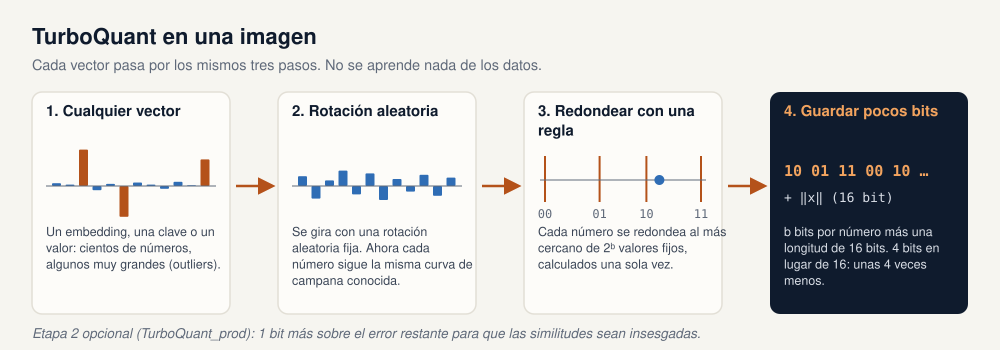

TurboQuant (Zandieh, Daliri, Hadian y Mirrokni, arXiv:2504.19874, abril de 2025) es un **cuantizador vectorial**: un algoritmo que convierte un vector de números reales en una cadena corta de bits, y de vuelta en una aproximación del original. Los autores lo diseñaron para dos cargas de trabajo que parecen distintas pero comparten el mismo cuello de botella:

* **Inferencia de LLM.** Mientras un modelo de lenguaje genera texto, mantiene una *caché clave-valor (KV)* con dos vectores por cada token anterior, en cada capa y en cada cabeza de atención. Esta caché, y no la aritmética del modelo, es lo que limita la longitud del contexto y el número de usuarios simultáneos. El apartado 1.1 explica la caché KV desde cero.
* **Búsqueda vectorial.** Las bases de datos vectoriales, la búsqueda semántica y la generación aumentada por recuperación (RAG) mantienen millones de embeddings en memoria y comparan cada consulta con todos ellos.

En ambos casos lo que de verdad importa es conservar los **productos internos** (las puntuaciones de similitud) entre vectores. TurboQuant comprime los vectores de forma que sus productos internos y distancias sigan siendo precisos, y lo hace con tres propiedades que rara vez aparecen juntas:

| Propiedad | Qué significa en la práctica |
|---|---|
| **Independiente de los datos (online)** | No aprende nada de los datos. Un vector se puede comprimir en el instante en que se produce, que es justo lo que necesita una caché KV. |
| **Casi óptimo** | El artículo demuestra que ningún cuantizador, de ningún tipo, puede hacerlo mucho mejor: el error de TurboQuant está a menos de unas 2,7 veces del límite teórico de la información, y a 1,45 veces con 1 bit. |
| **Apto para aceleradores** | Codificar es una multiplicación de matrices y una búsqueda en tabla, así que se vectoriza bien en GPU y CPU. |

> **Qué significa aquí "casi óptimo".** La teoría de la información pone un suelo: con *b* bits por coordenada, ningún cuantizador, por bueno que sea, puede lograr un error cuadrático medio menor que aproximadamente 1/4ᵇ para vectores unitarios (0,25 con 1 bit, 0,0625 con 2 bits). El artículo demuestra que el error de TurboQuant nunca supera √3·π/2 ≈ 2,7 veces ese suelo. Con 1 bit la distancia es aún menor: TurboQuant da unos 0,36 frente al suelo de 0,25, es decir, 1,45 veces. Por tanto, ni siquiera un cuantizador perfecto inventado en el futuro podría reducir el error más de 2,7 veces, y en la práctica la distancia medida está entre 1,4 y 2,4 veces (ver la tabla de la sección 3.7). Queda poco que ganar buscando un método mejor.

### 1.1 Contexto: cómo funciona la caché KV

> **En pocas palabras.** Un chatbot escribe su respuesta palabra a palabra, y antes de cada palabra nueva vuelve a leer todo lo escrito hasta ese momento. La caché KV es el cuaderno del modelo: guarda un resumen breve de cada palabra ya leída, para no tener que releerlo todo desde cero. Hace que las respuestas sean rápidas, pero el cuaderno crece con cada palabra y con cada usuario, y esa es la memoria que TurboQuant reduce.

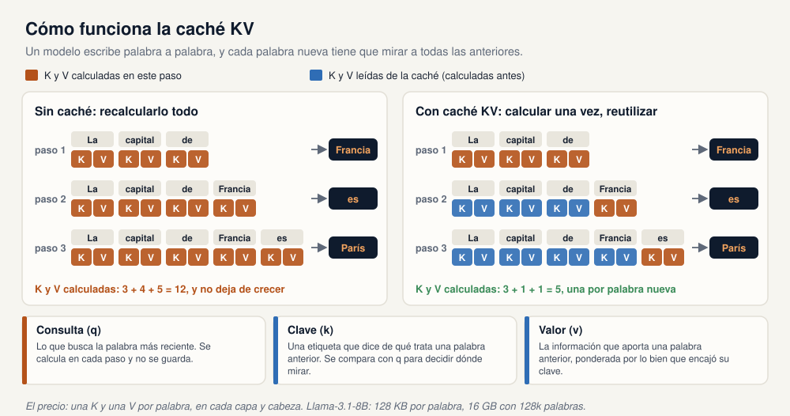

Un modelo de lenguaje genera texto token a token (un token es, más o menos, una palabra). Para elegir el siguiente token, cada capa del modelo ejecuta la **atención**, que funciona como una búsqueda:

* el token más reciente produce una **consulta** (q): lo que está buscando;
* cada token anterior tiene una **clave** (k): una etiqueta que dice de qué trata ese token;
* cada token anterior tiene también un **valor** (v): la información que aporta.

La consulta se compara con todas las claves, y los valores de los tokens que mejor encajan se combinan para decidir qué viene a continuación.

La figura sigue la frase *"La capital de"* mientras el modelo escribe *"Francia"*, *"es"* y *"París"*. **Sin caché** (izquierda), cada paso recalcula las claves y los valores de toda la frase: 3, luego 4, luego 5, así que el trabajo no deja de crecer con la longitud del texto. Pero la clave y el valor de un token no cambian una vez calculados. **Con caché KV** (derecha), el modelo los guarda y, en cada paso, solo calcula la clave y el valor del token nuevo y lee el resto de la memoria: 3, luego 1, luego 1.

Ese ahorro es la razón por la que todo servidor de LLM usa una caché KV. El coste pasa del cálculo a la **memoria**: una clave y un valor por token, en cada capa y en cada cabeza de atención, para cada conversación que se atiende. El siguiente apartado le pone cifra.

### 1.2 Por qué la memoria es el cuello de botella

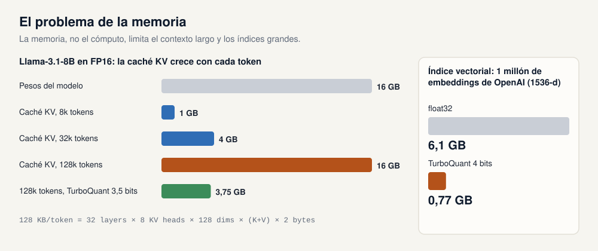

**Caché KV de un LLM.** Para Llama-3.1-8B en FP16, cada token necesita

`32 capas × 8 cabezas KV × 128 dimensiones × 2 (clave y valor) × 2 bytes = 128 KB`

de caché. Un contexto de 128k tokens necesita por tanto **16 GB**, tanto como los pesos del modelo. Cada token generado vuelve a leer la caché entera desde la memoria de la GPU, y ese tráfico de memoria, no el cálculo, es lo que marca la velocidad de decodificación. Menos memoria por token significa contextos más largos, más usuarios por GPU y atención más rápida cuando los kernels leen directamente los datos comprimidos.

**Índice vectorial.** Un millón de vectores de OpenAI `text-embedding-3-large` (1536 dimensiones, float32) ocupan **6,1 GB**. La cuantización por producto puede reducirlo, pero antes tiene que entrenar codebooks con k-means y volver a entrenarlos cuando los datos cambian. Con 4 bits, TurboQuant guarda el mismo índice en unos **0,77 GB** sin ningún entrenamiento.

### 1.3 La cuantización en un minuto

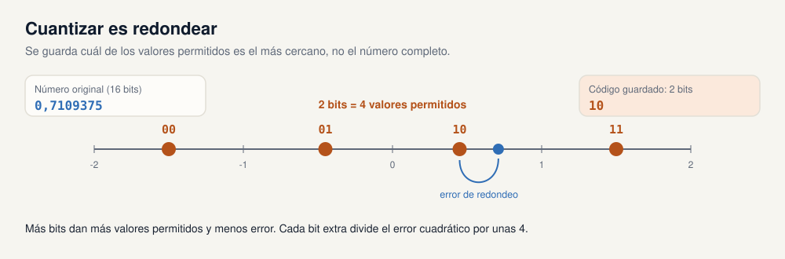

Cuantizar es **redondear**. En lugar de guardar un número exactamente, se guarda a cuál de unos pocos valores permitidos se parece más. Con *b* bits se pueden nombrar 2ᵇ valores: 4 valores con 2 bits, 16 con 4 bits. La diferencia entre el valor original y el redondeado es el *error de cuantización*. Dos preguntas deciden lo bueno que es un cuantizador:

1. **¿Dónde se colocan los valores permitidos?** Si están donde realmente caen los datos, el error es pequeño.
2. **¿Qué información extra hay que guardar?** La mayoría de los métodos también guardan, para cada bloque pequeño de números, una *escala* y un *punto cero* para saber cómo repartir los valores permitidos sobre el rango de ese bloque. Como muestra la sección 3.1, esa contabilidad puede costar un bit extra completo por número.

La respuesta de TurboQuant a ambas preguntas es el mismo truco: **rotar primero el vector de forma aleatoria**. Tras la rotación, cada coordenada sigue la misma distribución conocida, así que los mejores valores permitidos se pueden calcular una sola vez, por adelantado, para cualquier dato, y no hay escala por bloque que guardar.

### 1.4 Cómo funciona la cuantización, paso a paso

> **En pocas palabras.** Cuantizar es como poner a cada número un apodo corto. Se acuerdan de antemano unos pocos valores permitidos, se sustituye cada número por el código del más cercano y solo se guardan los códigos. Para recuperar los datos, se cambia cada código por su valor. Se pierde un poco de precisión y se ahorra mucha memoria.

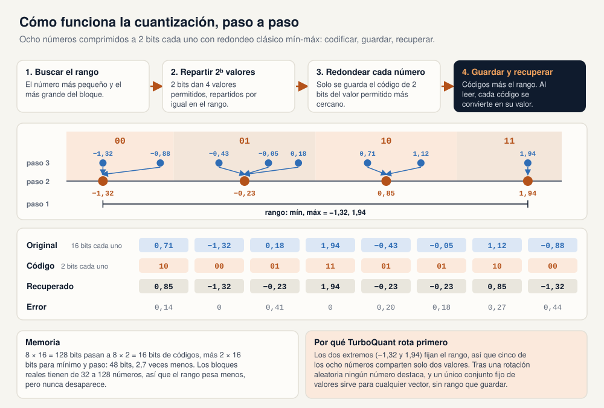

La figura sigue a ocho números a través de la receta clásica que usan los cuantizadores INT8 e INT4 (cuantización *mín-máx*, o *uniforme*) con 2 bits por número:

1. **Buscar el rango.** Se mira el bloque de números y se anotan el más pequeño (−1,32) y el más grande (1,94).
2. **Repartir 2ᵇ valores permitidos.** Con 2 bits hay 4 códigos: 00, 01, 10 y 11. Sus valores se reparten por igual en el rango, separados por un *paso*: −1,32, −0,23, 0,85 y 1,94 (paso = 3,26 / 3 = 1,09). Cada código se queda con el tramo de la recta más cercano a su valor.
3. **Redondear cada número.** Cada número se sustituye por el código del valor permitido más cercano: 0,71 pasa a `10`, −0,43 pasa a `01`, y así con todos. Es el único paso en el que se pierde información.
4. **Guardar y recuperar.** Se guardan los códigos bien empaquetados (ocho códigos de 2 bits caben en 16 bits), más el mínimo y el paso, que hacen falta para decodificar. Recuperar cuesta una multiplicación y una suma por número: valor = mínimo + código × paso.

La última fila de la tabla es el precio: cada número vuelve un poco desviado, como mucho medio paso (0,44 aquí). Más bits dan más valores permitidos, un paso más pequeño y menos error: cada bit extra divide el paso por dos y el error cuadrático por unas 4.

Dos debilidades de esta receta explican el resto de la guía:

* **El rango es un sobrecoste.** El mínimo y el paso se guardan con 16 bits de precisión en cada bloque. En la figura cuestan 32 bits además de los 16 bits de códigos. Los bloques reales son más grandes, pero con bloques de 32 números el rango sigue añadiendo un bit completo por número (sección 3.1).
* **Los valores atípicos malgastan los valores permitidos.** Los dos números extremos deciden el rango, así que los valores permitidos quedan muy separados y cinco de los ocho números tienen que compartir solo dos. Las claves y los embeddings reales tienen justo ese tipo de coordenadas atípicas (sección 3.6).

TurboQuant conserva los pasos 3 y 4 y sustituye los pasos 1 y 2. Primero, una rotación aleatoria reparte cada vector por igual entre sus coordenadas, de modo que ningún número destaca y todas las coordenadas siguen la misma campana conocida. Los valores permitidos se calculan una sola vez para esa campana (el codebook de Lloyd-Max, sección 3.3): están más juntos donde los números son frecuentes y son los mismos para cualquier vector, así que no se guarda ningún rango, solo una longitud de 16 bits por vector.

### 1.5 Resultados de un vistazo

| Afirmación | Fuente |
|---|---|
| Caché KV a **3,5 bits por canal** con la misma puntuación que la caché sin comprimir en LongBench (50,06 frente a 50,06, Llama-3.1-8B-Instruct). | Artículo, Tabla 1 |
| A **2,5 bits** la media de LongBench solo baja de 50,06 a 49,44. | Artículo, Tabla 1 |
| Recall de **0,997** en needle-in-a-haystack con compresión 4x, idéntico a la precisión completa, de 4k a 104k tokens. | Artículo, Figura 4 |
| Búsqueda vectorial: más recall que la cuantización por producto y RaBitQ en GloVe-200, OpenAI3-1536 y OpenAI3-3072, con un tiempo de indexación de **0,0013 s** frente a **240 s** para PQ (100k vectores, d = 1536, 4 bits). | Artículo, Tabla 2 y Figura 5 |
| Hasta **8x** más rápido en el cálculo de logits de atención con claves de 4 bits en H100. | Blog de Google Research |
| De **2,3x a 3,7x** más capacidad de caché KV en vLLM, con un 66 % a 80 % del throughput de BF16. | Blog de vLLM |

Las cifras de LongBench y de la aguja usan escalas distintas: la primera es una puntuación media de tareas sobre 100, la segunda una puntuación de recall entre 0 y 1. La sección 4.2 explica qué mide cada una.

---

## 2. Tres artículos, una idea

> **En pocas palabras.** TurboQuant es el tercer artículo de una serie corta del mismo grupo de Google Research. Los tres usan el mismo truco básico: mezclar primero los datos con una transformación aleatoria para que, sea cual sea la entrada, los números resultantes sigan un patrón conocido de antemano. Un patrón conocido se puede comprimir de forma eficiente sin estudiar los datos.

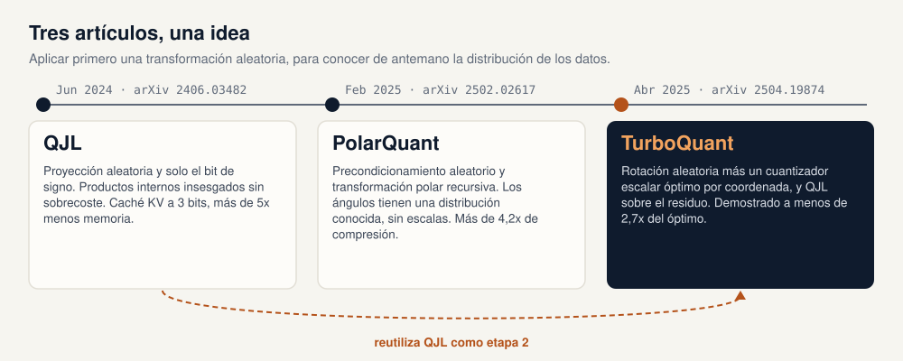

### 2.1 QJL: transformada de Johnson-Lindenstrauss cuantizada a 1 bit (junio de 2024)

*Zandieh, Daliri, Han. arXiv:2406.03482.*

**La observación que inició la serie.** Los cuantizadores clásicos de caché KV (KIVI, KVQuant y otros) agrupan los números en bloques y guardan una escala y un punto cero de precisión completa por bloque. Según el tamaño del bloque, este "sobrecoste de memoria" añade **de 1 a 2 bits extra por número cuantizado**.

**La idea.** Multiplicar el vector clave por una matriz gaussiana aleatoria *S* (una proyección de Johnson-Lindenstrauss) y quedarse solo con el **signo** de cada resultado: un bit por coordenada, más la norma del vector. No hay que guardar nada más.

**El estimador.** Para calcular una puntuación de atención ⟨q, k⟩, QJL aplica la misma proyección aleatoria a la consulta *sin* cuantizarla y la combina con los signos guardados. Este estimador *asimétrico* es **insesgado**: en promedio da exactamente el producto interno correcto.

**Un ejemplo con números pequeños.** Tomemos una clave de 4 dimensiones (las claves reales tienen de 64 a 128 dimensiones por cabeza) y proyectémosla a m = 3 bits. Tres bits son demasiado pocos para ser precisos; solo sirven para que las cuentas sean cortas.

1. **Clave y norma.** `k = [3, −4, 2, 0,5]`, así que `‖k‖ = √(9 + 16 + 4 + 0,25) = √29,25 ≈ 5,41`. La norma se guarda como un único número de coma flotante.
2. **Matriz gaussiana aleatoria.** Cada elemento de *S* (aquí 3 × 4) se extrae de una distribución normal estándar. Supongamos que sale:

   ```
   S = [  0.5  −0.2   0.8  −0.1 ]
       [ −0.9   0.1   0.3   0.7 ]
       [  0.2   0.6  −0.4  −0.5 ]
   ```

   *S* tampoco se guarda: se regenera a partir de una semilla aleatoria compartida cada vez que hace falta.
3. **Proyectar.** `S·k`, fila a fila:
   * 0,5·3 + (−0,2)·(−4) + 0,8·2 + (−0,1)·0,5 = 1,5 + 0,8 + 1,6 − 0,05 = **3,85**
   * (−0,9)·3 + 0,1·(−4) + 0,3·2 + 0,7·0,5 = −2,7 − 0,4 + 0,6 + 0,35 = **−2,15**
   * 0,2·3 + 0,6·(−4) + (−0,4)·2 + (−0,5)·0,5 = 0,6 − 2,4 − 0,8 − 0,25 = **−2,85**
4. **Quedarse con los signos.** `sign(S·k) = [+1, −1, −1]`, que se guarda como los bits `100` (1 significa +1 y 0 significa −1).

Lo que queda en memoria para esta clave: 3 bits más un número de coma flotante (5,41). Los cuatro números originales se descartan.

**Cómo se usan los bits.** Llega una consulta, por ejemplo `q = [1, −1, 1, 0]`; la puntuación exacta es `⟨q, k⟩ = 3 + 4 + 2 + 0 = 9`. La consulta se proyecta con la misma *S* pero **no** se cuantiza: `S·q = [1,5, −0,7, −0,8]`. El estimador de QJL es

`⟨q, k⟩ ≈ √(π/2) / m · ‖k‖ · ⟨S·q, sign(S·k)⟩`

Aquí `⟨S·q, sign(S·k)⟩ = 1,5·(+1) + (−0,7)·(−1) + (−0,8)·(−1) = 3,0`, así que la estimación es `1,2533 / 3 · 5,41 · 3,0 ≈ 6,78`, frente a un valor real de 9.

Tres cosas que el ejemplo deja claras:

* **Por qué √(π/2).** Para una fila gaussiana s, el promedio de `⟨s, q⟩ · sign(⟨s, k⟩)` es `√(2/π) · ⟨q, k⟩ / ‖k‖`. Multiplicar por `√(π/2) · ‖k‖` cancela ese factor, y eso es lo que hace al estimador insesgado. La norma devuelve la magnitud que los signos descartaron, y √(π/2) deshace el encogimiento que provoca quedarse con los signos.
* **Insesgado no significa exacto.** Una sola extracción de *S* dio 6,78. Promediando sobre 2.000 extracciones aleatorias de *S*, la estimación para este mismo par es 9,07 con una desviación típica de 4,4 con m = 3, de 0,91 con m = 64 y de 0,24 con m = 1.024. El error decrece como 1/√m, y por eso en la práctica se proyecta a tantos bits como la dimensión de la cabeza o más.
* **Sin XOR ni popcount.** Como la consulta se mantiene en precisión completa, la puntuación es una suma de las proyecciones de la consulta con el signo invertido según los bits guardados, no una distancia de Hamming. XOR más popcount corresponde al esquema simétrico en el que ambos vectores se reducen a signos (SimHash): la fracción de bits distintos estima el ángulo entre ellos dividido por π. Esa variante es más barata pero suma el error de cuantizar la consulta, y QJL la evita a propósito. Los bits recogen la dirección de la clave sobre la esfera unidad euclídea habitual; no interviene ninguna geometría hiperbólica.

En TurboQuant la misma receta se aplica al residuo `r` que deja la primera etapa, así que la norma guardada es `‖r‖` y no `‖k‖` (sección 3.5).

**Resultados.** Una caché KV de 3 bits con más de **5x** menos memoria y sin pérdida de precisión, con un kernel CUDA más rápido que la referencia.

**Papel en TurboQuant.** QJL se convierte en la segunda etapa opcional de TurboQuant: un bit de signo por coordenada aplicado al error restante.

### 2.2 PolarQuant (febrero de 2025)

*Han, Kacham, Karbasi, Mirrokni, Zandieh. arXiv:2502.02617.*

**La idea.** Aplicar un precondicionamiento aleatorio (una rotación) y convertir el vector a **coordenadas polares** con una transformación recursiva: los pares de coordenadas se convierten en un radio y un ángulo, los radios se vuelven a emparejar, y así durante log₂ d niveles (4 niveles en la práctica). Después se cuantizan los ángulos.

**Por qué funciona.** Tras el precondicionamiento aleatorio, los ángulos tienen una distribución cuya forma se puede calcular analíticamente (lema 2 del artículo). Los ángulos del primer nivel son uniformes entre 0 y 2π. Los del nivel ℓ ≥ 2 están entre 0 y π/2 con densidad proporcional a sin^(2^(ℓ−1) − 1)(2ψ): centrada en π/4 (45°) y más estrecha en cada nivel. Como la distribución es conocida, no hace falta normalizar cada bloque, así que no se guardan escalas ni puntos cero. El artículo usa 4 bits para los ángulos del primer nivel y 2 bits para los niveles superiores, porque el rango del primer nivel es cuatro veces más ancho.

**Un ejemplo con números pequeños.** Tomemos un vector de 4 dimensiones ya rotado, `v = [3, −4, 2, 0,5]` (las cabezas reales tienen 128 dimensiones). Con d = 4 el árbol tiene log₂ 4 = 2 niveles:

```
Nivel 2 (raíz):          ‖v‖ = 5,41      ángulo ψ = 22,4°   (rango 0 a 90°)
                        /          \
Nivel 1:            R_A = 5      R_B = 2,06
                    θ₁ = 306,9°  θ₂ = 14,0°                (rango 0 a 360°)
                    /    \        /    \
Entrada:          x₁=3  x₂=−4   x₃=2  x₄=0,5
```

1. **Nivel 1: emparejar las coordenadas.** `(x₁, x₂) = (3, −4)` da un radio `R_A = √(9 + 16) = 5` y un ángulo `θ₁ = atan2(−4, 3) = −53,1°`, que se toma como 306,9° para que quede entre 0 y 360°. `(x₃, x₄) = (2, 0,5)` da `R_B = √4,25 = 2,06` y `θ₂ = atan2(0,5, 2) = 14,0°`.
2. **Nivel 2: emparejar los radios.** `(R_A, R_B)` da el radio `√(25 + 4,25) = 5,41`, que es la norma del vector completo, y el ángulo `ψ = arctan(R_B / R_A) = 22,4°`. Los dos radios son no negativos, así que ψ siempre está entre 0 y 90°.
3. **Cuantizar los ángulos.** El nivel 1 usa 4 bits, 16 intervalos de 22,5° con centros en 11,25°, 33,75°, …: θ₁ = 306,9° cae en el intervalo 13 (centro 303,75°) y θ₂ = 14,0° en el intervalo 0 (centro 11,25°). El nivel 2 usa 2 bits. Sus cuatro centroides salen de k-means en 1-D sobre la densidad del nivel 2 (el artículo los construye con k-means++): 17,7°, 36,3°, 53,7° y 72,3°. ψ = 22,4° pasa a 17,7°, índice 0.

Lo que queda en memoria: 4 + 4 + 2 = 10 bits de índices de ángulo más un número flotante (5,41). Los cuatro flotantes originales se descartan.

**La decodificación** recorre el árbol de arriba abajo con cosenos y senos: `R_A ≈ 5,41·cos 17,7° = 5,15`, `R_B ≈ 5,41·sin 17,7° = 1,65`, y después `v̂ = [5,15·cos 303,75°, 5,15·sin 303,75°, 1,65·cos 11,25°, 1,65·sin 11,25°] = [2,86, −4,28, 1,62, 0,32]`. El error relativo es del 9,7 %; con la consulta `q = [1, −1, 1, 0]` la puntuación es 8,76 frente a un valor exacto de 9.

Cuatro puntos que el ejemplo hace concretos:

* **Cuánto se estrechan los niveles superiores.** La densidad del nivel 2 es simplemente sin 2ψ, que es ancha: su desviación típica es 19,6°, frente a 26,0° de un ángulo uniforme en el mismo rango. Baja a 14,2° en el nivel 3 y a 10,1° en el nivel 4. Los centroides de 2 bits lo reflejan: de 17,7° a 72,3° en el nivel 2, de 30,0° a 60,0° en el nivel 4.
* **Un radio por bloque, no por vector.** En la práctica la recursión se detiene tras L = 4 niveles, así que cada bloque de 16 coordenadas guarda un radio de 16 bits. Un bloque guarda 8 ángulos × 4 bits + 4 × 2 + 2 × 2 + 1 × 2 = 46 bits más el radio: 62 bits para 16 números, es decir, **3,875 bits por coordenada**, unas 4,1 veces menos que con flotantes de 16 bits. Una cabeza de 128 dimensiones tiene 8 radios así. El único estado adicional es el pequeño libro de códigos de centroides, compartido por todos los vectores en lugar de guardarse por bloque. El "más de 4,2x" del resumen es el titular del propio artículo; queda algo por encima de lo que da esta cuenta de 3,875 bits, y en sus pruebas de LongBench el artículo deja en precisión completa los tokens generados.
* **El libro de códigos se ajusta una vez, no por vector.** La distribución de los ángulos se conoce en teoría, pero el artículo ajusta los centroides con k-means++ en 1-D sobre ángulos observados, ya sea en línea (una vez por prompt y capa, durante el prefill) o fuera de línea (un único libro de códigos para todos los prompts, capas y cabezas). La variante en línea puntúa algo mejor.
* **Qué aporta la rotación.** Para el análisis el artículo multiplica por una matriz con entradas gaussianas independientes; en la implementación usa una rotación aleatoria compartida por todas las capas, cabezas, claves y valores. Las transformadas de Hadamard aleatorias rápidas cumplen el mismo papel en otros trabajos, pero no son lo que usó PolarQuant. En una prueba con vectores sintéticos de colas pesadas (d = 128, 2.000 vectores, los libros de códigos anteriores), el error cuadrático relativo fue del 3,2 % con la rotación y del 13,6 % sin ella.

**Resultados.** Más de **4,2x** de compresión de la caché KV con las mejores puntuaciones de calidad entre los métodos comparados en pruebas de contexto largo.

**Papel en TurboQuant.** El blog de Google describe la primera etapa de TurboQuant como una compresión "al estilo PolarQuant". En el propio artículo de TurboQuant, esa etapa conserva el principio de PolarQuant (rotar primero, para que la distribución se conozca de antemano y no hagan falta escalas por bloque), pero prescinde de la transformación polar: cuantiza cada coordenada rotada con un cuantizador escalar de Lloyd-Max (sección 3), que es más sencillo y tiene una cota de distorsión demostrada.

### 2.3 TurboQuant (abril de 2025)

*Zandieh, Daliri, Hadian, Mirrokni. arXiv:2504.19874.*

TurboQuant simplifica y generaliza los dos trabajos anteriores:

1. **TurboQuant_mse** (Algoritmo 1): rotación aleatoria y luego un cuantizador escalar *óptimo* (Lloyd-Max) para cada coordenada. Minimiza el error cuadrático medio (MSE).
2. **TurboQuant_prod** (Algoritmo 2): TurboQuant_mse con un bit menos y después QJL de 1 bit sobre el residuo. Da productos internos **insesgados**.
3. **Cotas inferiores que encajan**: una demostración, con la cota inferior de Shannon y el principio minimax de Yao, de que ningún cuantizador puede bajar de una distorsión de 4⁻ᵇ, así que TurboQuant está a una constante pequeña del óptimo.
4. **Experimentos** de compresión de caché KV (needle in a haystack, LongBench con Llama-3.1-8B-Instruct y Ministral-7B-Instruct) y de búsqueda de vecinos más cercanos (embeddings OpenAI3 de DBpedia, GloVe).

| | QJL | PolarQuant | TurboQuant |
|---|---|---|---|
| Transformación aleatoria | Proyección gaussiana | Precondicionamiento aleatorio | Rotación aleatoria |
| Qué se cuantiza | Signo de cada coordenada proyectada | Ángulos polares | Cada coordenada rotada (+ signos del residuo) |
| Escalas por bloque | Ninguna | Ninguna | Ninguna |
| Bits | 1 por coordenada (claves) | unos 3,9 por canal | cualquier b; 2,5 y 3,5 con división de outliers |
| Objetivo | Caché KV | Caché KV | Caché KV y búsqueda vectorial |
| Garantía | Productos internos insesgados | Distribución analítica de los ángulos | Distorsión de MSE y de producto interno a ≈2,7x de la cota inferior |

---

## 3. Cómo funciona TurboQuant

### 3.1 El impuesto oculto de la cuantización clásica

> **En pocas palabras.** La compresión habitual de números necesita una pequeña "leyenda" por cada bloque de 32 números que explica cómo leerlos. Esa leyenda se guarda con precisión completa y, con pocos bits, puede ocupar un tercio del espacio total. TurboQuant no necesita leyenda, solo un número por vector.

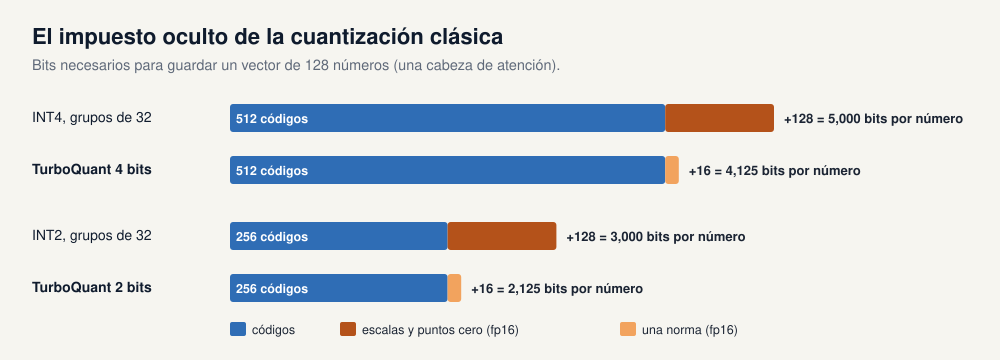

Un cuantizador por bloques estándar (INT-*b* al estilo KIVI, o el `QuantizedCache` de Hugging Face) divide un vector en grupos de, por ejemplo, 32 números. Para cada grupo guarda el mínimo (punto cero) y el tamaño del paso (escala) en fp16, y luego cada número como un entero de *b* bits. Para una cabeza de atención de 128 números:

| Esquema | Bits de código | Sobrecoste | Bits efectivos por número |
|---|---|---|---|
| FP16 | 16 | 0 | 16 |
| INT4, escala + cero por 32 | 4 | 32 bits / 32 números = 1,0 | **5,0** |
| INT2, escala + cero por 32 | 2 | 1,0 | **3,0** |
| TurboQuant 4 bits | 4 | una norma fp16 / 128 = 0,125 | **4,125** |
| TurboQuant 2 bits | 2 | 0,125 | **2,125** |

Con 2 bits, el sobrecoste clásico es un impuesto del 50 %. TurboQuant solo guarda la longitud del vector (su norma L2) en fp16, porque tras la rotación todos los bloques tienen el mismo rango conocido.

### 3.2 Paso 1: rotación aleatoria

> **En pocas palabras.** Imagina un vector como una flecha en un espacio con cientos de direcciones. Rotar la flecha no cambia su longitud ni los ángulos entre flechas, así que no se pierde información. Pero reparte la "energía" de la flecha por igual entre todas las coordenadas, de modo que ninguna coordenada queda enorme.

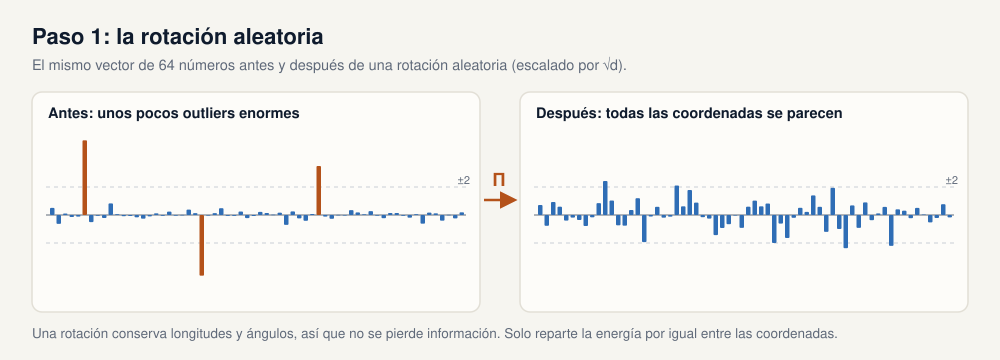

TurboQuant divide primero el vector por su norma y lo multiplica por una matriz ortogonal aleatoria fija Π (generada una vez a partir de una semilla y compartida por todos los vectores):

`y = Π · x / ‖x‖`

**Por dentro.** El vector rotado es un punto aleatorio uniforme sobre la esfera unidad. El Lema 1 del artículo da la distribución exacta de cada una de sus coordenadas, una distribución Beta escalada:

`f(x) ∝ (1 − x²)^((d−3)/2)` en [−1, 1]

En dimensiones altas se parece mucho a una normal N(0, 1/d). Dos hechos hacen que el resto del algoritmo funcione:

* **La distribución se conoce de antemano y es la misma para todas las coordenadas y todas las entradas.** Los canales outlier, que tanto afectan a las cachés KV, quedan repartidos por la rotación.
* **Las coordenadas distintas son casi independientes** (no solo incorreladas) en dimensiones altas. Por eso cuantizar cada coordenada por separado, sin mirar las demás, es casi óptimo para el vector completo.

En `turboquant_core.py`, `random_rotation(d, seed)` construye Π a partir de la descomposición QR de una matriz gaussiana, con una corrección de signos para que la rotación tenga distribución uniforme (de Haar).

### 3.3 Paso 2: una regla fija (el codebook de Lloyd-Max)

> **En pocas palabras.** Como cada coordenada rotada sigue la misma curva de campana, el mejor conjunto de valores permitidos ("la regla") se calcula una vez y se reutiliza para todo. Se colocan más valores donde la curva es alta, que es donde caen la mayoría de los números.

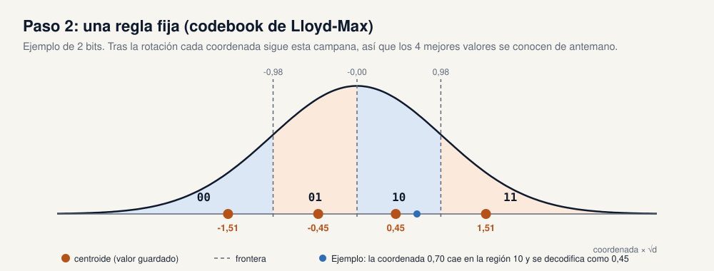

Para un ancho de bits *b*, TurboQuant necesita 2ᵇ *centroides* (valores permitidos) que minimicen el error cuadrático esperado de redondeo para la distribución Beta anterior. Es un problema de k-means continuo en una dimensión que se resuelve con el clásico **algoritmo de Lloyd-Max**: alternar entre colocar las fronteras a mitad de camino entre centroides y mover cada centroide a la media de la probabilidad de su celda.

Para d = 128, los centroides, en unidades de 1/√d, son:

| Bits | Centroides × √d |
|---|---|
| 1 | ±0,80 |
| 2 | ±0,45, ±1,51 |
| 3 | ±0,24, ±0,75, ±1,34, ±2,13 |

Cada coordenada rotada se sustituye por el índice de su centroide más cercano (`torch.bucketize` contra las fronteras). Los codebooks solo dependen de *d* y *b*, así que se calculan una vez (`lloyd_max_codebook`, con caché) y nunca se reentrenan.

### 3.4 Codificar y decodificar, de principio a fin

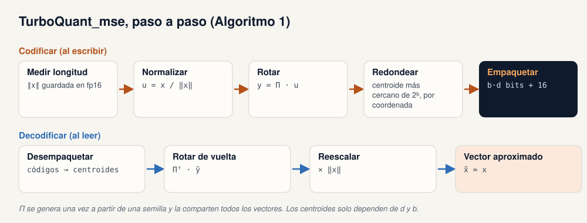

**Codificar** (`TurboQuant.quantize`): guardar ‖x‖ en fp16, normalizar, rotar, redondear cada coordenada a su centroide más cercano y empaquetar los índices en bits. Almacenamiento: **b·d bits + 16 bits** por vector.

**Decodificar** (`TurboQuant.dequantize`): desempaquetar los índices, buscar los centroides, rotar de vuelta con Πᵀ y multiplicar por la norma guardada.

**Por dentro.** Para buscar, ni siquiera hace falta decodificar. Como las rotaciones conservan los productos internos, `⟨q, x̃⟩ = ‖x‖ · ⟨Π·q, c[idx]⟩`: se rota la consulta una sola vez y se puntúa directamente contra los centroides de cada vector guardado. El notebook de búsqueda vectorial hace exactamente eso (`TurboQuantSearch.search`), y los kernels de GPU fusionados usan la misma identidad para calcular las puntuaciones de atención directamente desde los códigos empaquetados.

La opción `renorm=True` reescala la reconstrucción para que su norma coincida con la guardada. Esta *corrección de norma* tan barata es parecida en espíritu a las variantes `_nc` de vLLM.

### 3.5 Etapa 2: productos internos insesgados (TurboQuant_prod)

> **En pocas palabras.** Redondear al valor permitido más cercano tiende a acortar un poco los vectores, así que las similitudes salen algo bajas en promedio. TurboQuant puede dedicar uno de sus bits a un pequeño "boceto de corrección" del error de redondeo. Así las puntuaciones son correctas en promedio, a cambio de algo más de ruido.

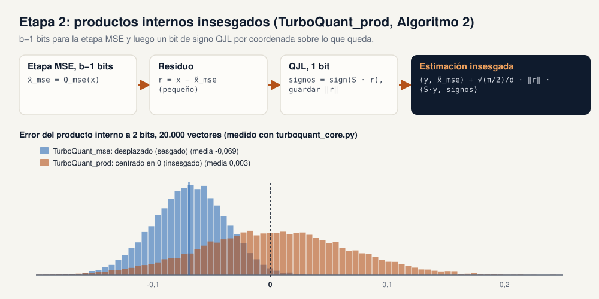

**El problema.** Un cuantizador óptimo en MSE está **sesgado** para los productos internos: encoge los vectores hacia los centroides, así que ⟨y, x̃⟩ infravalora ⟨y, x⟩. Con 1 bit la estimación esperada es (2/π)·⟨y, x⟩, un 36 % por debajo. En la comprobación teórica del notebook de LLM (d = 128, 20.000 vectores) el sesgo medido es de aproximadamente −36 % con 1 bit, −12 % con 2 bits y −3,5 % con 3 bits.

**La solución** (Algoritmo 2):

1. Cuantizar con TurboQuant_mse usando **b − 1** bits: x̃_mse.
2. Calcular el residuo r = x − x̃_mse. Es pequeño.
3. Aplicar QJL al residuo: guardar sign(S·r) (1 bit por coordenada) y ‖r‖ (fp16).
4. Estimar: `⟨y, x̃_mse⟩ + √(π/2)/d · ‖r‖ · ⟨S·y, sign(S·r)⟩`.

El Teorema 2 del artículo demuestra que este estimador es **insesgado** para cualquier y, con un error de producto interno como máximo `√3·π²·‖y‖²/d · 4⁻ᵇ`.

**La contrapartida.** Insesgado no es lo mismo que más preciso. El bit de QJL añade varianza y la etapa MSE tiene un bit menos. Con pocos bits gana la versión insesgada; a partir de unos 3 bits, TurboQuant_mse sin más tiene menos error total. La Figura 3 del artículo muestra el cruce, y la figura de arriba lo muestra a 2 bits: los errores de MSE están desplazados a la izquierda (sesgo) y los de prod están centrados en cero pero más dispersos.

**Consecuencia práctica para los LLM.** La atención pasa las puntuaciones por un softmax, que amplifica el ruido. Esa es una razón probable de que las implementaciones de caché KV en producción (vLLM) usen la variante MSE con corrección de norma en lugar de la variante QJL. Esto es una inferencia nuestra a partir de las mediciones y de lo que ofrece vLLM, no una afirmación del artículo.

### 3.6 Canales outlier y anchos de bit fraccionarios

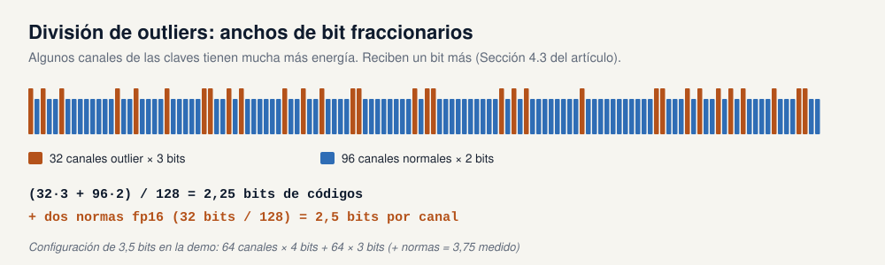

Las claves de los LLM reales tienen unos pocos canales con una magnitud mucho mayor que el resto. Siguiendo trabajos anteriores, el artículo divide los canales de cada cabeza en un conjunto outlier y un conjunto normal y aplica **dos instancias independientes de TurboQuant**, dando a los outliers un bit más. De ahí salen las configuraciones de **2,5 bits** y **3,5 bits** del artículo:

* 2,5 bits: 32 canales outlier a 3 bits + 96 canales a 2 bits. Los códigos solos suman (32·3 + 96·2)/128 = 2,25 bits por canal. Con las dos normas fp16 se miden exactamente **2,5** bits por canal.
* Configuración de 3,5 bits en la demo: 64 canales a 4 bits + 64 a 3 bits = 3,5 bits de códigos, **3,75** medidos con las normas.

`MixedTurboQuant` implementa esta división. Su método `calibrate` elige como outliers los canales con mayor valor absoluto medio en una muestra (el prefill).

### 3.7 ¿Qué tan cerca del óptimo?

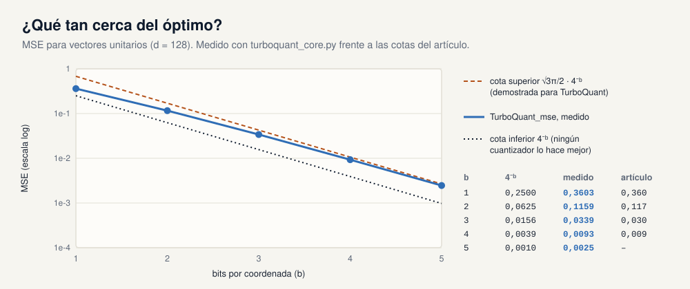

El artículo demuestra cotas que encierran el error de TurboQuant para vectores unitarios:

| MSE, vectores unitarios | b = 1 | b = 2 | b = 3 | b = 4 |
|---|---|---|---|---|
| Cota inferior, cualquier cuantizador: 4⁻ᵇ | 0,250 | 0,063 | 0,016 | 0,0039 |
| **Medido con `turboquant_core.py`** (d = 128) | **0,360** | **0,116** | **0,034** | **0,0093** |
| Artículo | 0,36 | 0,117 | 0,03 | 0,009 |
| Cota superior de TurboQuant: √3π/2 · 4⁻ᵇ | 0,680 | 0,170 | 0,043 | 0,0106 |

* Cada bit extra divide el error por 4, que es la mejor tasa que puede lograr cualquier cuantizador.
* La distancia a la cota inferior nunca supera √3π/2 ≈ 2,7 veces, y es solo de 1,45 veces con 1 bit.
* Los métodos independientes de los datos anteriores solo tenían garantías poco ajustadas.

La implementación de referencia reproduce los números del artículo. La prueba básica de `CURSOR_HANDOFF.md` (T1) pasó en la máquina del taller con MSE 0,3607 / 0,116 / 0,034 / 0,0093 para 1 a 4 bits, y comprueba que el empaquetado de bits ida y vuelta funciona de 1 a 5 bits.

### 3.8 El algoritmo en código

La implementación de referencia (`turboquant_core.py`, unas 400 líneas de PyTorch) se corresponde directamente con el artículo:

| Artículo | `turboquant_core.py` |
|---|---|
| Lema 1, Ec. (4): cuantizador escalar óptimo para la distribución Beta | `lloyd_max_codebook(d, bits)` |
| Teorema 1: d·C(f_X, b) | `codebook_mse_cost(d, bits)` |
| Rotación aleatoria Π | `random_rotation(d, seed)` |
| Algoritmo 1, TurboQuant_mse | `TurboQuant(d, bits, mode="mse")` |
| Algoritmo 2, TurboQuant_prod | `TurboQuant(d, bits, mode="prod")` |
| División de outliers (Sección 4.3) | `MixedTurboQuant(d, n_out, bits_hi, bits_lo)` |
| Referencia: INT-b con escala y cero por grupo | `UniformQuant(d, bits, group=32)` |
| b·d bits por vector, medidos | `pack_bits`, `unpack_bits`, `nbytes` |
| Integración en la caché KV | `TurboQuantCache` (Hugging Face transformers v5) |

```python
import torch
from turboquant_core import TurboQuant

q = TurboQuant(d=128, bits=4, mode="mse", seed=0)
x = torch.randn(1000, 128)
c = q.quantize(x)            # códigos empaquetados + normas fp16
x_hat = q.dequantize(c)      # vectores aproximados
print(c.nbytes() / 1000)     # 66 bytes por vector en lugar de 256 en fp16
```

---

## 4. Caso de uso 1: inferencia de LLM (la caché KV)

> **En pocas palabras.** Cuando un chatbot escribe una respuesta, cada palabra nueva tiene que mirar a todas las anteriores. Para no recalcularlo todo, el modelo guarda una memoria de todas las palabras previas: la caché KV. Esa memoria crece con cada palabra y con cada usuario. TurboQuant la guarda entre 4 y 6 veces más pequeña, así que la misma GPU puede atender documentos más largos o más usuarios.

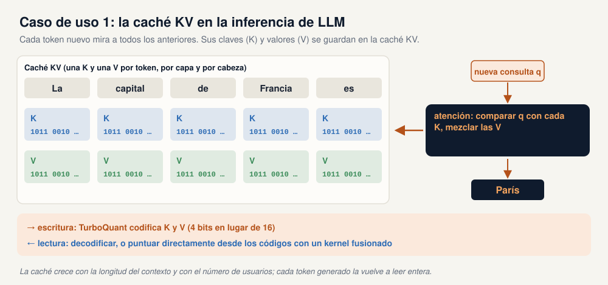

### 4.1 Qué es la caché KV

Una capa de transformer convierte cada token en una **consulta** (q), una **clave** (k) y un **valor** (v). Para producir el siguiente token, la atención compara la nueva consulta con las claves de todos los tokens anteriores (productos internos ⟨q, k⟩), convierte esas puntuaciones en pesos con un softmax y mezcla los valores con esos pesos. Las claves y valores de los tokens pasados no cambian, así que el modelo los guarda en caché: un vector clave y un vector valor por token, por capa y por cabeza KV. El apartado 1.1 lo recorre paso a paso.

Aquí es donde encaja TurboQuant:

* **Al escribir**, cada nuevo vector clave y valor se rota, se cuantiza y se empaqueta en bits. Esto ocurre token a token durante la generación. No hace falta ninguna pasada de calibración, lo que descarta a la mayoría de los métodos dependientes de los datos.
* **Al leer**, o bien se decodifican los códigos a vectores antes de la atención (la implementación de referencia), o bien un kernel fusionado calcula ⟨q, k⟩ directamente desde los códigos (producción).

A diferencia de KIVI y PolarQuant en la comparación del artículo, TurboQuant también cuantiza los tokens producidos durante la generación, no solo el prompt.

### 4.2 Qué dice el artículo

**LongBench-E** (Llama-3.1-8B-Instruct, media de QA de un documento, QA multidocumento, resumen, few-shot, tareas sintéticas y código):

| Método | Bits KV | Media |
|---|---|---|
| Caché completa | 16 | 50,06 |
| KIVI | 3 | 48,50 |
| KIVI | 5 | 50,16 |
| PolarQuant | 3,9 | 49,78 |
| **TurboQuant** | **2,5** | **49,44** |
| **TurboQuant** | **3,5** | **50,06** |

En Ministral-7B-Instruct, TurboQuant a 2,5 bits obtiene 49,62 frente a 49,89 de la caché completa.

> **Qué es LongBench-E y qué significa la puntuación.** LongBench (Bai et al., THUDM, 2023) es un benchmark de contexto largo con tareas de preguntas y respuestas, resumen, few-shot, tareas sintéticas y completado de código. LongBench-E es su subconjunto equilibrado por longitud: 13 conjuntos de datos en inglés y de código, remuestreados para que haya un número parecido de entradas de 0–4k, 4k–8k y más de 8k tokens. Por eso encaja con los métodos de compresión, cuyo daño puede crecer con la longitud del contexto. Cada tarea se puntúa automáticamente de 0 a 100 con su propia métrica: F1 de solapamiento de palabras con la respuesta de referencia en la mayoría de las tareas de QA, ROUGE-L en los resúmenes, exactitud en clasificación y en las tareas sintéticas, y similitud de edición en código. La **Media** es por tanto una puntuación de calidad media, no un porcentaje de respuestas correctas, y solo tiene sentido junto a la caché completa del mismo modelo. No es la media de las seis columnas por categoría de la Tabla 1 del artículo (saldría unos 48,5), así que presumiblemente es la media sobre los conjuntos de datos individuales, que el artículo no publica. Una media empatada no es un empate en todo: a 3,5 bits TurboQuant queda algo por debajo de la caché completa en QA de un documento (45,01 frente a 45,29) y algo por encima en QA multidocumento (45,31 frente a 45,16). El texto del artículo dice LongBench-E y el pie de la Tabla 1 dice LongBench-V1.

**Needle in a haystack** (Llama-3.1-8B-Instruct, documentos de 4k a 104k tokens, 25 % de la memoria de la caché completa):

| Método | Puntuación |
|---|---|
| Precisión completa | 0,997 |
| **TurboQuant** | **0,997** |
| PolarQuant | 0,995 |
| KIVI | 0,981 |
| PyramidKV | 0,895 |
| SnapKV | 0,858 |

Los métodos que descartan tokens (SnapKV, PyramidKV) eliminan los que consideran poco importantes y por eso pierden agujas. La cuantización conserva todos los tokens, solo que con menos bits.

> **Qué es Needle in a Haystack y qué significa la puntuación.** La prueba (Kamradt, 2023), "la aguja en el pajar", esconde una frase, la *aguja*, a una profundidad elegida de un documento largo de relleno, el *pajar*, y pide al modelo que la recupere. El artículo sigue el montaje de Fu et al. (2024): longitudes de documento de 4k a 104k tokens y profundidades de la aguja del 0 % al 100 % del documento, que juntas forman la cuadrícula del mapa de calor de su Figura 4. Cada celda recibe una puntuación de 0 a 1, y la cifra de la tabla es la media de toda la cuadrícula. El artículo la llama puntuación de recall, "lo fielmente que el modelo recupera la frase escondida", sin dar la fórmula. En el código de evaluación que reutilizan la mayoría de los artículos de caché KV (KVCache-Factory, de los autores de PyramidKV), cada respuesta se puntúa por su solapamiento de palabras con la aguja (ROUGE-1), así que una respuesta en parte correcta suma puntos parciales. Hay que leer 0,997 como "las respuestas reprodujeron la aguja casi a la perfección en todas las longitudes y profundidades", no como "el 99,7 % de las pruebas acertó". La condición de memoria importa tanto como la puntuación: todos los métodos comprimidos usaron el 25 % de la caché completa. La Demo 1 puntúa de forma más estricta: una prueba cuenta como acierto solo si el código exacto aparece en la respuesta (sección 6.1).

### 4.3 En producción

* **Blog de Google Research:** hasta **8x** más rápido en el cálculo de logits de atención con claves TurboQuant de 4 bits frente a claves de 32 bits en H100, y al menos 6x menos memoria KV en tareas de aguja con claves de 3 bits.
* **vLLM** (0.20.2 y posteriores) incluye kernels fusionados: `--kv-cache-dtype turboquant_4bit_nc`, `turboquant_k8v4`, `turboquant_k3v4_nc`, `turboquant_3bit_nc`. El blog de vLLM informa de **2,3x a 3,7x** más capacidad de caché KV con un **66 % a 80 %** del throughput de BF16. Las variantes agresivas de 3 bits pierden hasta unos 20 puntos en tareas difíciles de matemáticas y código; FP8 sigue siendo la opción neutra en throughput.

El resumen honesto: **la ganancia segura es la capacidad** (contextos más largos, más peticiones simultáneas por GPU). La velocidad depende de tener kernels fusionados, y las configuraciones más agresivas hay que evaluarlas con tus propias tareas.

> **Qué es un kernel fusionado.** Un *kernel* es una función que se ejecuta en la GPU. Sin fusión, una caché comprimida necesita un kernel que desempaqueta los códigos y escribe claves y valores en precisión completa de vuelta en la memoria de la GPU, y después el kernel de atención habitual, que los vuelve a leer. Esa copia descomprimida cuesta tanto tráfico de memoria como una caché sin comprimir, más el desempaquetado, así que decodificar se vuelve más lento. Un kernel *fusionado* hace los dos trabajos en una sola pasada: lee los códigos empaquetados, reconstruye cada clave y valor en los registros del chip y calcula ⟨q, k⟩, el softmax y la suma ponderada de valores sin guardar nunca la caché descomprimida. Con TurboQuant puede incluso no reconstruir las claves: rota la consulta una vez y la puntúa directamente contra los valores del codebook (sección 3.4). Decodificar está limitado por el tráfico de memoria (sección 1.2), así que leer 3 o 4 bits por número en lugar de 16 es de donde sale la aceleración. `turboquant_core.py` no es un kernel fusionado; por eso ahorra memoria pero decodifica más despacio que FP16.

### 4.4 Lo que da la compresión

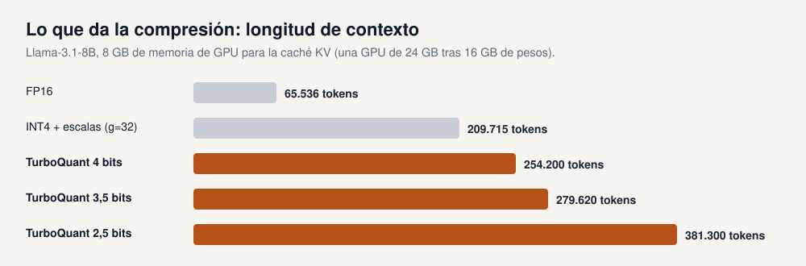

Para Llama-3.1-8B con 8 GB de memoria de GPU reservados para la caché KV (una GPU de 24 GB tras 16 GB de pesos):

| Caché | Bytes por token | Contexto máximo en 8 GB |
|---|---|---|
| FP16 | 128 KB | 65.536 tokens |
| INT4 + escala/cero (grupos de 32) | 40 KB | 209.715 tokens |
| TurboQuant 4 bits | 33 KB | 254.200 tokens |
| TurboQuant 3,5 bits | 30 KB | 279.620 tokens |
| TurboQuant 2,5 bits | 22 KB | 381.300 tokens |

Estas cifras salen de la fórmula de la sección 5 del notebook de LLM y coinciden con la diapositiva "Demo 1 · Memory".

---

## 5. Caso de uso 2: búsqueda vectorial y RAG

> **En pocas palabras.** Una base de datos vectorial responde a preguntas como "¿cuáles de mis millones de documentos se parecen más a este?". Guarda un vector por documento y compara el vector de la pregunta con todos ellos. TurboQuant reduce los vectores guardados de 8 a 16 veces y, a diferencia del método habitual, no necesita antes un entrenamiento lento, así que los documentos nuevos se pueden añadir en cuanto llegan.

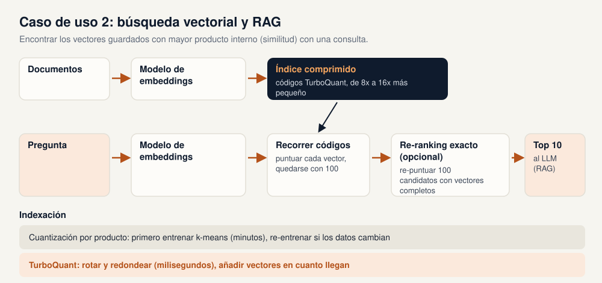

### 5.1 Cómo funciona la búsqueda vectorial

1. Un **modelo de embeddings** convierte cada documento (o imagen, o producto) en un vector, de forma que los elementos parecidos tengan vectores con un producto interno alto (similitud coseno, para vectores normalizados).
2. Los vectores se guardan en un **índice**.
3. La consulta se convierte en vector con el mismo modelo y el índice devuelve los **top-k** vectores más parecidos.
4. En **RAG**, esos top-k documentos se pasan a un LLM como contexto.

Para colecciones grandes, el índice tiene que comprimirse para caber en RAM. La herramienta estándar es la **cuantización por producto (PQ)**: dividir cada vector en subvectores y sustituir cada subvector por el más cercano de 256 (o 16) centroides aprendidos con k-means. La sección 5.4 explica cómo funciona PQ y cómo se compara con TurboQuant.

### 5.2 Por qué encaja TurboQuant

* **Sin entrenamiento.** PQ tiene que ejecutar k-means antes de poder codificar nada, y volver a entrenar cuando cambia la distribución de los datos. El codebook de TurboQuant está fijado de antemano, así que indexar es una multiplicación de matrices y una búsqueda por intervalos.
* **Más recall con los mismos bits.** Como la rotación hace que todas las coordenadas se parezcan, un único codebook escalar es casi óptimo, y el artículo encuentra que supera a PQ incluso cuando PQ se entrenó con los mismos datos con los que se evaluó.
* **Puntuación rápida.** Se rota la consulta una vez y se puntúa contra los centroides (sección 3.4). Implementaciones SIMD como `turbovec` lo hacen más rápido que la búsqueda exacta.
* **Búsqueda en dos etapas.** Recorrer el índice comprimido para obtener unos 100 candidatos y volver a puntuar solo esos con los vectores completos guardados en disco. El recall queda prácticamente exacto con una fracción pequeña de la memoria.

### 5.3 Qué dice el artículo

**Tiempo de indexación**, 100k vectores, cuantización a 4 bits (segundos):

| Método | d = 200 | d = 1536 | d = 3072 |
|---|---|---|---|
| Cuantización por producto | 37,04 | 239,75 | 494,42 |
| RaBitQ | 597,25 | 2267,59 | 3957,19 |
| **TurboQuant** | **0,0007** | **0,0013** | **0,0021** |

El **Recall@1@k** (con qué frecuencia el vecino más cercano real está entre los k primeros resultados) superó a PQ y RaBitQ en GloVe (d = 200) y en las entidades de DBpedia con embeddings de OpenAI `text-embedding-3-large` (d = 1536 y d = 3072), tanto a 2 como a 4 bits. Los experimentos usaron 100k vectores de base de datos y 1k consultas (10k en GloVe).


### 5.4 Cuantización por producto (PQ), el método con el que se compara TurboQuant

> **En pocas palabras.** La cuantización por producto es la forma clásica de reducir un índice vectorial, y es la referencia con la que se compara TurboQuant en el artículo y en nuestra demo. Corta cada vector en trozos pequeños y guarda, para cada trozo, un diccionario de trozos típicos aprendido de los datos. Cada trozo se guarda como el número de su entrada más parecida del diccionario. Comprime bien, pero los diccionarios hay que aprenderlos con tus datos antes de poder guardar nada, y volver a aprenderlos cuando los datos cambian.

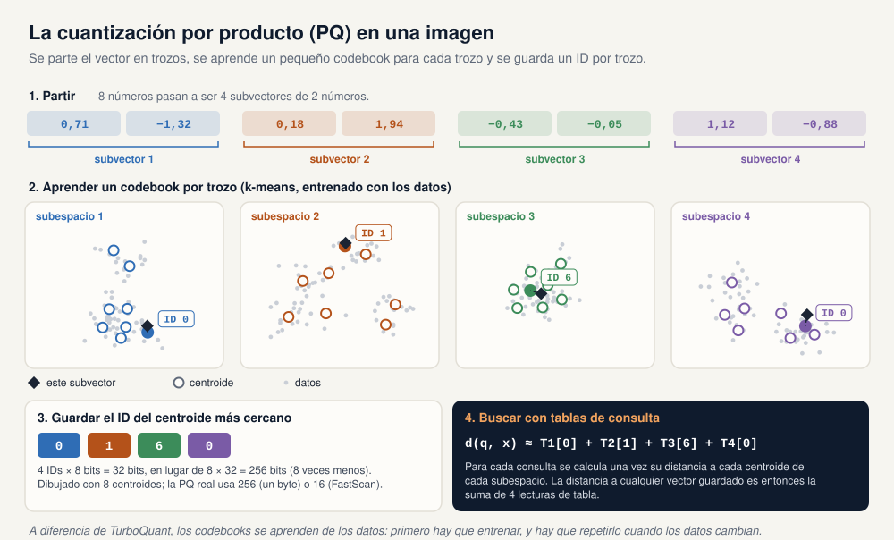

PQ (Jégou, Douze y Schmid, 2011, referencia 9) funciona en cuatro pasos:

1. **Partir.** Cada vector de d números se corta en m subvectores de d/m números. La figura corta 8 números en 4 subvectores de 2.
2. **Aprender un codebook por subespacio.** Para cada una de las m posiciones se ejecuta k-means sobre los subvectores de una muestra de entrenamiento. Así se obtienen k centroides por subespacio: normalmente k = 256, para que un ID quepa en un byte, o k = 16 (medio byte) en la variante FastScan.
3. **Codificar.** Cada subvector se sustituye por el ID de su centroide más cercano. Un vector pasa a ser m enteros pequeños: m bytes cuando k = 256.
4. **Buscar con tablas de consulta.** Para cada consulta se calcula una vez el producto interno (o la distancia) entre cada subvector de la consulta y cada centroide de su subespacio: una tabla de m × k números. La puntuación de cualquier vector guardado es entonces la suma de m lecturas de esa tabla, en las posiciones de sus IDs. La consulta nunca se comprime; a esto se le llama *cálculo asimétrico de distancias*.

El nombre viene de que el conjunto de vectores que PQ puede representar es el *producto* cartesiano de los m codebooks pequeños. Con m = 4 y k = 256 hay 256⁴, unos 4.000 millones, de vectores reconstruidos posibles, descritos con solo 4 × 256 centroides guardados.

**Bits por número.** PQ gasta m × log₂ k bits por vector, así que el presupuesto de bits lo fijan m y k. En la demo a 4 bits por número (384 dimensiones, 8 veces menos que float32), `FAISS PQ LUT256` usa m = 192 subvectores de 2 números con 256 centroides cada uno, 192 bytes por vector, justo la configuración dibujada en la figura. `FAISS PQ-FastScan` llega al mismo presupuesto con m = 384 subvectores de 1 número y 16 centroides cada uno.

**PQ frente a TurboQuant.**

| | Cuantización por producto | TurboQuant |
|---|---|---|
| Codebook | Aprendido con k-means sobre tus datos, uno por subespacio | Fijado de antemano e igual para cualquier dato (Lloyd-Max para una campana, sección 3.3) |
| Qué se redondea | Un grupo de números (un subvector) a la vez | Un número cada vez, tras una rotación aleatoria |
| Antes de guardar el primer vector | Entrenar: 240 s para 100k vectores de 1536 dimensiones en el artículo; 83 s en nuestra demo | Nada: 0,0013 s para indexar esos mismos 100k vectores en el artículo |
| Cuando los datos cambian | Volver a entrenar y recodificar el índice | No cambia nada |
| Recall@1@1 a 4 bits en la demo (sección 6.2) | 0,818 | 0,944 (turbovec) |
| Puntuar una consulta | Tablas de consulta construidas para cada consulta; muy rápido con FastScan | Rotar la consulta una vez y puntuar contra los centroides (sección 3.4) |

**¿Por qué un codebook fijo gana a uno aprendido?** La ventaja de PQ es que sus centroides siguen a los datos, incluidas las correlaciones entre los números de un mismo subvector. TurboQuant elimina esa necesidad: tras la rotación aleatoria todas las coordenadas siguen la misma distribución conocida y son casi independientes, así que un codebook escalar fijo ya está cerca del óptimo (sección 3.7). Además, PQ reparte sus pocos centroides según la muestra de entrenamiento, que puede alejarse de los datos que se indexan después.

**Cuándo PQ sigue siendo buena opción.** PQ es un método maduro y está disponible casi en todas partes (FAISS `IndexPQ` e `IndexIVFPQ`, Milvus `IVF_PQ`, la cuantización por producto de Qdrant), y puede bajar de 1 bit por número (por ejemplo, un byte para 16 números), algo que no puede hacer un cuantizador que redondea número a número. Para una colección estática que se entrena una vez y casi no cambia, sigue siendo una opción razonable. TurboQuant tiene más ventaja donde los vectores llegan sin parar (una caché KV, un índice vivo) o donde volver a entrenar es caro.

---

## 6. Las demos

Las dos demos son notebooks de Colab generados a partir de los scripts `.py` de este repositorio (`build_notebooks.py` los reconstruye e incrusta `turboquant_core.py` en una celda `%%writefile`, así que cada notebook funciona por sí solo).

**Cómo ejecutarlas:**

1. Ir a colab.research.google.com › File › Upload notebook.
2. Demo de LLM: Runtime › Change runtime type › **T4 GPU** (nivel gratuito). Demo vectorial: basta con CPU.
3. Runtime › Run all. Si la primera celda actualiza `transformers` a la v5, reiniciar la sesión una vez y volver a ejecutar.

| Archivo | Qué es |
|---|---|
| `llm_kv_cache_demo.ipynb` | Demo de caché KV; cambiar `MODEL_ID` para probar otro modelo |
| `vector_search_demo.ipynb` | Benchmark de búsqueda; cambiar `DATASET` a `dbpedia-3072` o `20newsgroups-lsa` |
| `turboquant_core.py`, `*.py` | La implementación y las versiones en script de las dos demos |

### 6.1 Demo 1: inferencia de LLM (`llm_kv_cache_demo.ipynb`)

**Objetivo:** mostrar TurboQuant comprimiendo la caché KV de un modelo real, medir lo que hace con la calidad, la memoria y la velocidad, y compararlo con una caché INT-*b* clásica que paga por las escalas.

**Configuración:** Qwen2.5-1.5B-Instruct (28 capas, 2 cabezas KV, head_dim 128) en una T4 en FP16; en CPU cambia a Qwen2.5-0.5B-Instruct con entradas más cortas. El punto de integración es una caché de Hugging Face intercambiable:

```python
from turboquant_core import TurboQuantCache, mixed_factory

cache = TurboQuantCache(
    model.config,
    make_k=mixed_factory(0.25, 3, 2),   # 32 canales a 3 bits + 96 a 2 bits
    make_v=mixed_factory(0.25, 3, 2),
)
out = model.generate(ids, past_key_values=cache, max_new_tokens=64)
print(cache.nbytes())                    # medido a partir de los tensores empaquetados
```

El modelo no cambia. Cada capa tiene su propia rotación aleatoria (semilla = índice de la capa).

**Recorrido por secciones del notebook:**

| Sección del notebook | Qué muestra | Sección de la guía |
|---|---|---|
| 1. Theory check | MSE frente a las cotas del artículo para b = 1 a 5; sesgo de MSE frente a la variante prod insesgada; densidad de las coordenadas rotadas con los centroides de 3 bits | 3.2 a 3.7 |
| 2. Load a model | Las diez configuraciones de caché comparadas: FP16, TurboQuant 4 / 3,5 / 3 / 2,5 / 2 bits, TurboQuant_prod con claves de 3 bits, INT4 / INT3 / INT2 con escalas | 3.1, 3.6 |
| 3. Quality | Perplejidad, divergencia KL respecto al modelo FP16 y acuerdo top-1, con el texto en bloques de 128 tokens para que cada bloque atienda a la caché comprimida de todo lo anterior | 4.2 |
| 4. Needle in a haystack | Un código escondido al 10 %, 50 % y 90 % de documentos de 2k, 4k y 8k tokens; cada token de la respuesta se genera desde la caché comprimida | 4.2 |
| 5. Memory | Bytes de caché medidos y pico de memoria de GPU; proyección para Llama-3.1-8B | 4.4 |
| 6. Speed | Tokens por segundo al decodificar; por qué la caché de referencia es más lenta y dónde entran los kernels fusionados | 4.3 |

**Memoria medida** (tensores empaquetados, normas fp16 incluidas, head_dim 128):

| Caché | Bits por canal | frente a FP16 |
|---|---|---|
| FP16 | 16 | 1,0x |
| INT4, escala + cero por 32 | 5,0 | 3,2x |
| TurboQuant 4 bits | 4,125 | 3,9x |
| TurboQuant 3,5 (64 a 4b + 64 a 3b) | 3,75 | 4,3x |
| TurboQuant 3 bits | 3,125 | 5,1x |
| TurboQuant 2,5 (32 a 3b + 96 a 2b) | 2,5 | 6,4x |
| TurboQuant 2 bits | 2,125 | 7,5x |

**Qué observar al ejecutarla:**

* La referencia sin comprimir debería encontrar la aguja en todas las longitudes y profundidades. Si no lo hace, el problema es el prompt, no la cuantización.
* La perplejidad y la KL deberían empeorar al bajar los bits, con TurboQuant a 4 bits cerca de la referencia.
* Comparar TurboQuant a unos 3 bits con INT2 (3,0 bits efectivos) e INT3 (4,0 bits efectivos) muestra el impuesto de las escalas de la sección 3.1.
* En este notebook, decodificar con TurboQuant es **más lento** que con FP16. Es lo esperado: la caché de referencia decuantiza todo el historial en PyTorch en cada paso. La velocidad requiere kernels fusionados (sección 4.3).

> **Estado de los números.** Las cifras de memoria de arriba son exactas para esta implementación. Los números de calidad, aguja y velocidad para Qwen se obtienen al ejecutar el notebook en una GPU; no se pudieron medir en el sandbox en la nube donde se escribió el código (sin descargas de modelos). `CURSOR_HANDOFF.md` (prueba T2) enumera las ejecuciones pendientes.

### 6.2 Demo 2: búsqueda vectorial (`vector_search_demo.ipynb`)

**Objetivo:** reproducir la comparación de búsqueda del artículo: recall, tamaño del índice, tiempo de construcción y velocidad de consulta de TurboQuant frente a referencias entrenadas.

**Métodos comparados:**

| Método | Entrenamiento | Notas |
|---|---|---|
| Exacto float32 (FAISS `IndexFlatIP`) | ninguno | verdad de referencia |
| **TurboQuant (PyTorch de referencia)** | ninguno | `turboquant_core.py`, variantes MSE y prod, 2 y 4 bits |
| **turbovec** | ninguno | implementación de TurboQuant en Rust + SIMD (`pip install turbovec`) |
| FAISS PQ, 256 centroides por subespacio (LUT256) | k-means | la referencia PQ del artículo |
| FAISS PQ-FastScan, 16 centroides | k-means | la PQ más rápida de FAISS |
| FAISS RaBitQ | ligero | la otra referencia del artículo |
| FAISS SQ 4 bits | mín/máx | cuantización escalar simple por dimensión |

**Datos:** por defecto, las entidades de DBpedia del artículo con embeddings de OpenAI `text-embedding-3-large` (1536 dimensiones), descargadas en streaming desde el Hugging Face Hub: 100k vectores de base de datos y 1k consultas. También están disponibles `dbpedia-3072` y una alternativa sin conexión, `20newsgroups-lsa`.

**Recorrido por secciones del notebook:**

| Sección del notebook | Qué muestra | Sección de la guía |
|---|---|---|
| 1. Load embeddings | Descarga el conjunto de datos y normaliza los vectores para que la similitud coseno sea igual al producto interno | 5.1 |
| 2. Ground truth and metrics | Top-100 exacto con FAISS; Recall@1@k y 10@10 | 5.3 |
| 3. TurboQuant, reference implementation | Codificación sin entrenamiento; puntuación en el espacio rotado; variantes MSE y prod | 3.4, 3.5 |
| 4. turbovec | El mismo algoritmo con kernels SIMD | 5.2 |
| 5. Trained baselines | FAISS PQ, PQ-FastScan, RaBitQ, SQ4, contando el entrenamiento k-means como tiempo de indexación | 5.3 |
| 6. Results | Tabla y curvas de recall a 2 y 4 bits; gráfico de tiempos de indexación | 6.2 |
| 7. Online ingestion | 100k vectores añadidos en lotes de 1.000 sin entrenamiento | 5.2 |
| 8. Two-stage search | Top-100 comprimido y luego re-ranking exacto | 5.2 |

**Resultados de la ejecución en el sandbox.** El sandbox en la nube no podía acceder al Hugging Face Hub, así que la ejecución de abajo usó 100k + 1k vectores de embeddings de 384 dimensiones de texto real (corpus Reuters, Gutenberg y Brown; TF-IDF + SVD), con 4 hilos de CPU. Mismo protocolo que el artículo, distintos datos. Son los números de las diapositivas "Demo 2".

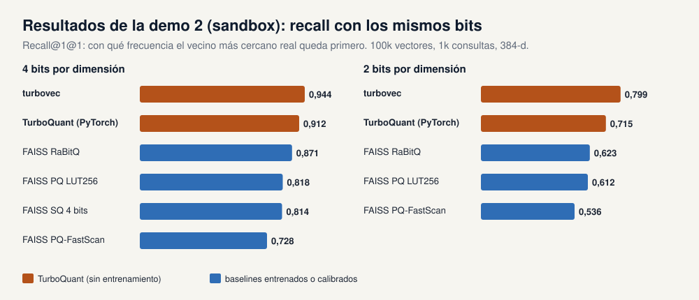

| Método | Bits | Más pequeño | Construcción (s) | QPS | R1@1 | 10@10 |
|---|---|---|---|---|---|---|
| **turbovec** | 4 | 7,7x | 0,9 | 10.008 | **0,944** | **0,951** |
| **TurboQuant_mse (PyTorch)** | 4 | 7,9x | 0,9 | 950 | **0,912** | **0,934** |
| FAISS RaBitQ | 4 | 7,2x | 1,4 | 862 | 0,871 | 0,891 |
| FAISS PQ LUT256 | 4 | 8,0x | 83,4 | 390 | 0,818 | 0,870 |
| FAISS SQ4 | 4 | 8,0x | 0,06 | 470 | 0,814 | 0,856 |
| FAISS PQ-FastScan | 4 | 8,0x | 4,4 | 3.784 | 0,728 | 0,808 |
| **turbovec** | 2 | 15,0x | 0,8 | 9.340 | **0,799** | **0,832** |
| **TurboQuant_mse (PyTorch)** | 2 | 15,7x | 0,7 | 1.039 | **0,715** | **0,802** |
| FAISS RaBitQ | 2 | 13,2x | 0,9 | 1.717 | 0,623 | 0,704 |
| FAISS PQ LUT256 | 2 | 16,0x | 6,6 | 930 | 0,612 | 0,724 |
| FAISS PQ-FastScan | 2 | 16,0x | 1,6 | 6.342 | 0,536 | 0,649 |

La búsqueda exacta en float32 alcanzó 857 QPS.

**Tres mensajes de esta ejecución:**

1. **Más recall sin entrenamiento.** A 4 bits, turbovec sitúa el vecino más cercano real en primer lugar el 94 % de las veces, frente al 82 % de PQ, y PQ necesitó antes 83 segundos de k-means.
2. **Ingesta online.** Se añadieron 100k vectores a turbovec en 0,14 s, en lotes de 1.000, sin ningún entrenamiento.
3. **Resultados exactos tras un re-ranking barato.** Volver a puntuar el top 100 de turbovec con los vectores completos dio un Recall@1 = **1,000**.

> **Estado de los números.** La ejecución con DBpedia-1536 en Colab es la configuración de referencia del artículo; sus resultados sustituirán a la tabla del sandbox cuando se midan (`CURSOR_HANDOFF.md`, prueba T3). Una dimensión mayor debería favorecer aún más a TurboQuant, porque las coordenadas rotadas se vuelven más gaussianas y más independientes al crecer d.

---

## 7. Recomendaciones prácticas

**Caché KV**

* Empezar con **4 bits** (con corrección de norma). Probar **3,5** y **2,5** bits con canales outlier, los puntos óptimos del artículo.
* Usar la **variante MSE para las claves**. El bit de QJL añade varianza que el softmax amplifica con pocos bits.
* Para ganar velocidad, servir con los **kernels fusionados de vLLM** en GPU Ampere o Hopper; la caché PyTorch de referencia ahorra memoria pero es más lenta que FP16.
* **Hacer evaluaciones propias** (sobre todo de razonamiento, matemáticas y código) antes de bajar a 3 bits o menos.

**Búsqueda vectorial**

* **turbovec a 4 bits** da un índice 8 veces más pequeño que float32 con un recall alto.
* **Re-ranking del top 100** con vectores exactos para resultados casi perfectos.
* **2 bits** dan una compresión de 16x cuando lo que importa es recall@8 o superior.
* **Sin entrenamiento:** añadir vectores online y no volver a indexar nunca porque los datos hayan cambiado.

---

## 8. Casos de estudio reales: dos funciones en las que comprimir no ayudó

> **En pocas palabras.** Las secciones 4 y 5 muestran dónde brilla TurboQuant. Un taller también necesita el caso contrario. Probamos TurboQuant, y las opciones int8, binaria y BBQ que ya traen las bases de datos, en dos funciones de "buscar similares" de una plataforma real de documentos legales. TurboQuant se comportó como promete el artículo y, aun así, en ninguno de los dos casos ayudó, porque la precisión de los vectores no era lo que limitaba la función. La historia completa, con todas las tablas, está en el [capítulo del caso de estudio](Caso_Estudio_Similitud_Provisiones_ES.md).

Todos los números de esta sección vienen de reconstrucciones locales de las dos funciones, ejecutadas con datos reales de la plataforma (`es_bench/` y `memo_bench/`). No son mediciones del sistema en producción. Este repositorio no contiene datos de clientes: solo números agregados.

### 8.1 Las dos funciones

| | A. Provisiones similares | B. Respuestas sugeridas en memos de comentarios |
|---|---|---|
| Qué ve el usuario | "Provisiones similares a esta, por encima del X %" en la base de provisiones de una firma | Respuestas pasadas a preguntas parecidas mientras se responde un comentario nuevo |
| Puntuación oficial | **Distancia de edición** (`rapidfuzz.fuzz.ratio`, 0–100) sobre el texto limpio | **Coseno** entre embeddings `text-embedding-3-large` (3.072 dimensiones) |
| Dónde vive | Una matriz de pares precalculada en PostgreSQL; se guarda si ≥ 30, la interfaz usa 70 por defecto | Una colección de Qdrant; búsqueda **exacta** filtrada por firma, 50 resultados, umbral 0,5 y luego 0,42 |
| Problema | Crecimiento del almacenamiento y escrituras lentas: cada provisión nueva se compara con todas las de la firma | Latencia por petición |
| ¿Importan los vectores? | Existen embeddings (`text-embedding-3-small`, 1.536 dimensiones) en Elasticsearch, pero **ninguna función los lee** | Sí, son la búsqueda |

**Primero, comprobar la premisa.** El primer plan de benchmark (`provision_search_benchmark.*`, `PROVISION_SEARCH_CHECKS.md`) suponía una colección de Qdrant con embeddings de provisiones y un umbral de coseno de 0,90 para la fusión automática. Al leer el código de la plataforma se vio que no existe ninguna de las dos. Qdrant solo guarda memos de comentarios, y la fusión automática también usa distancia de edición. El benchmark se reescribió para Elasticsearch (`es_bench/`).

### 8.2 Caso A: provisiones similares (`es_bench/`)

**Montaje.** Una réplica local del índice de la plataforma: 2.501 textos de provisiones distintos, limpiados como los limpia la plataforma, con embeddings del mismo modelo, en un Elasticsearch 8.18 local con el mismo mapping. Verdad de referencia: `fuzz.ratio` exacto de 500 provisiones de consulta contra las 2.501. Antes de confiar en ningún número se ejecutan doce comprobaciones con respuesta conocida (`canary.py`), por ejemplo el código de trigramas contra el `pg_trgm` real de PostgreSQL.

**¿Cuántos pares son "similares"?** Dos provisiones legales largas sin relación ya puntúan alrededor de 38, así que un umbral bajo guarda casi todos los pares:

| Se guarda si fuzz.ratio ≥ | 30 | 40 | 50 | 60 | 70 |
|---|---|---|---|---|---|
| Porcentaje de pares guardados | **70 %** | 45 % | **1,6 %** | 0,8 % | 0,7 % |

Para una firma con 500.000 provisiones son unos 87.000 millones de pares con umbral 30, y unos 2.000 millones con 50.

**¿Cambia la compresión los pares encontrados?** Los vecinos por coseno comprimidos solo podrían elegir *qué* pares puntuar. Recall de los pares con fuzz.ratio ≥ 70 entre 200 candidatos por provisión:

| Método | Memoria frente a float32 | Coincidencia del top-10 con float32 (sin re-scoring → re-scoring 2×) | Recall de pares fuzz ≥ 70 @200 |
|---|---|---|---|
| float32 | 1× | 1,000 | 99,8 % |
| int8 escalar | 4× menos | 0,949 → 0,999 | 99,8 % |
| binario 1 bit | 32× menos | 0,824 → 0,962 | 99,7 % |
| TurboQuant 4 bits | 8× menos | **0,966 → 1,000** | 99,8 % |
| TurboQuant 2 bits | 16× menos | **0,902 → 0,992** | 99,8 % |
| Vecinos por trigramas (`pg_trgm`), sin vectores | – | – | **100 %** |

TurboQuant conserva los vecinos por coseno mejor que int8 o binario con cada presupuesto de bits, como promete el artículo. Los pares que puntúa el producto no se mueven, porque son casi duplicados que todos los métodos encuentran. Las opciones propias de Elasticsearch coinciden: la coincidencia del top-10 con la búsqueda exacta es 0,993 para `hnsw`, 0,986 para `int8_hnsw`, 0,950 para `int4_hnsw` (0,996 con re-scoring) y 0,878 para `bbq_hnsw` (0,995 con re-scoring). Elasticsearch 8.18 ya aplica `int8_hnsw` por defecto cuando el mapping no elige nada.

**Conclusión A: TurboQuant no puede ayudar.** La puntuación es distancia de edición, no coseno, y el coste es el número de pares guardados, que ninguna técnica vectorial cambia. Las palancas son el umbral (una decisión de producto) y un filtro de candidatos; los trigramas, ya disponibles en PostgreSQL, funcionan tan bien como los embeddings.

### 8.3 Caso B: sugerencias en memos de comentarios (`memo_bench/`)

**Montaje.** Una reconstrucción local del camino de los memos: 1.238 comentarios reales (685 preguntas, 553 respuestas), el modelo de la plataforma, la misma versión de Qdrant, búsqueda exacta con filtro por firma, excluyendo el propio hilo, 50 resultados y umbrales 0,5 y luego 0,42. Primero, una comprobación con respuesta conocida: los resultados de Qdrant coinciden con una búsqueda exacta en numpy en 200 de 200 consultas.

**Dónde se va el tiempo en una petición de sugerencias:**

| Paso | Tiempo (p50) |
|---|---|
| Embedding del comentario nuevo (llamada a la API) | ~240 ms |
| Búsqueda vectorial, 1.238 memos, exacta | **~14 ms** |
| Comprobación de relevancia con LLM sobre los 12 primeros (una llamada de tamaño similar, no la de la plataforma) | **~3.800 ms** |

**¿Cuándo importaría la búsqueda?** Todos los memos en una sola firma, el peor caso para una búsqueda exacta:

| Memos en la firma | Búsqueda exacta p50 | RAM de vectores, float32 | Con el int8 propio de Qdrant |
|---|---|---|---|
| 10.000 | 21 ms | 117 MB | 29 MB |
| 50.000 | 53 ms | 586 MB | 146 MB |
| 200.000 | 339 ms | 2,3 GB | 0,6 GB (255 ms) |

**¿Cambia la compresión las sugerencias?** Umbral 0,5, pares del top 50 de cada pregunta:

| Método | Memoria por vector | Coincidencia del top-10 | Sugerencias perdidas en 0,5 |
|---|---|---|---|
| float32 | 12 KB | 1,000 | 0 |
| int8 escalar (offline) | 3 KB | 0,965 | 1.438 de 22.193 (6,5 %) |
| **TurboQuant 4 bits** | 1,5 KB | **0,983** | **244 (1,1 %)** |
| TurboQuant 2 bits | 0,75 KB | 0,945 | 3.574 (16 %) |
| int8 / binario de Qdrant **con re-scoring** | – | – | **0** |

**Conclusión B: TurboQuant tampoco ayuda aquí.** La búsqueda vectorial es mucho menos del 1 % de la petición, las sugerencias se calculan en segundo plano y la cuantización propia de Qdrant con re-scoring no pierde nada sin código nuevo. Lo que sí encontró el benchmark: dos memos al azar ya puntúan 0,38 de media (percentil 95: 0,56), así que el umbral 0,5 deja pasar unos 152 candidatos por pregunta. La calidad de las sugerencias depende del re-ranker y de la comprobación con LLM, no de la precisión de los vectores.

### 8.4 Lista de comprobación: antes de comprimir vectores

1. **¿Dónde se escriben y se leen los vectores?** Si nadie los lee, la pregunta es si seguir pagándolos, no cómo comprimirlos.
2. **¿La puntuación del producto es vectorial?** Si es distancia de edición, BM25 o una regla, los vectores solo pueden prefiltrar, y un prefiltro léxico puede hacerlo igual de bien.
3. **¿Qué domina el coste?** Cuenta elementos guardados, llamadas a modelos y viajes de red. La compresión reduce bytes por vector, no el número de nada.
4. **¿La búsqueda es exacta o aproximada?** La búsqueda exacta sobre conjuntos pequeños filtrados rara vez está limitada por memoria.
5. **Valida los instrumentos.** Comprueba cada medición con una respuesta conocida antes de confiar en ella.

---

## 9. Limitaciones y preguntas abiertas

* **La implementación de referencia no es un kernel.** `turboquant_core.py` decuantiza en PyTorch: ahorra memoria, pero decodificar es más lento que con FP16. Las aceleraciones reales necesitan kernels fusionados (vLLM o kernels Triton de la comunidad).
* **Insesgado no siempre es mejor.** La etapa QJL de TurboQuant_prod elimina el sesgo pero añade varianza; a partir de 3 bits, y dentro de un softmax, la variante MSE suele ser la mejor opción.
* **Las configuraciones agresivas cuestan precisión en tareas difíciles.** vLLM informa de caídas de hasta unos 20 puntos en matemáticas y código difíciles con las variantes de 3 bits. 4 bits es la opción segura por defecto.
* **La división de outliers necesita una muestra de calibración.** `MixedTurboQuant` elige los canales outlier a partir del prefill. Es ligero, pero no es estrictamente independiente de los datos.
* **Beam search y el recorte de la caché** no están soportados por el `TurboQuantCache` de la demo; usar decodificación voraz o muestreo.
* **Mediciones pendientes.** Los números de calidad, aguja y velocidad para Qwen, y los resultados de búsqueda con DBpedia-1536, todavía hay que medirlos en hardware real (ver `CURSOR_HANDOFF.md`).
* **Comprimir no siempre es la palanca.** Si la puntuación del producto no es vectorial, o el coste es el número de elementos guardados o de llamadas a modelos, comprimir vectores no cambia nada. Dos ejemplos con datos reales están en la sección 8 y en el [capítulo del caso de estudio](Caso_Estudio_Similitud_Provisiones_ES.md).

---

## 10. Glosario

| Término | Significado |
|---|---|
| **Vector / embedding** | Lista de números que representa un token, un documento o una imagen. Los elementos parecidos tienen vectores parecidos. |
| **Producto interno (producto escalar)** | Suma de los productos elemento a elemento de dos vectores; la puntuación de similitud estándar. Las puntuaciones de atención y de búsqueda son productos internos. |
| **Similitud coseno** | Producto interno de dos vectores escalados a longitud 1. |
| **Cuantización** | Guardar números con menos bits redondeándolos a un conjunto pequeño de valores permitidos. |
| **Ancho de bits (b)** | Bits por número guardado. 16 en FP16, 4 en INT4 o en TurboQuant de 4 bits. |
| **Bits por canal** | Almacenamiento efectivo por número, incluido cualquier sobrecoste como escalas o normas. |
| **Escala y punto cero** | Números por bloque que guardan los cuantizadores clásicos para convertir los enteros de vuelta a valores reales. |
| **Norma (‖x‖)** | La longitud de un vector. TurboQuant la guarda en 16 bits. |
| **Rotación aleatoria (Π)** | Una matriz ortogonal aleatoria. Conserva longitudes y ángulos y reparte la energía por igual entre las coordenadas. |
| **Cuantizador / codebook de Lloyd-Max** | El conjunto de valores permitidos que minimiza el error cuadrático esperado para una distribución conocida; se calcula con un k-means en 1-D. |
| **Centroide** | Uno de los valores permitidos del codebook. |
| **MSE (error cuadrático medio)** | Distancia cuadrática media entre el vector original y el reconstruido. |
| **Sesgo** | Un error sistemático: estimaciones demasiado altas o demasiado bajas en promedio. |
| **Estimador insesgado** | Un estimador que acierta en promedio. |
| **QJL** | Transformada de Johnson-Lindenstrauss cuantizada: proyección aleatoria quedándose solo con los signos; da productos internos insesgados. |
| **Residuo** | Lo que queda tras la primera etapa de cuantización: r = x − x̃. |
| **Caché KV** | Las claves y valores guardados de los tokens anteriores en un transformer, reutilizados en cada paso de generación. |
| **Atención** | La operación del transformer que compara la consulta actual con todas las claves de la caché y mezcla los valores. |
| **Prefill / decode** | Procesar el prompt de una vez / generar tokens uno a uno. |
| **Canal outlier** | Una coordenada de las claves o valores con una magnitud mucho mayor que las demás. |
| **Kernel fusionado** | Una rutina de GPU que hace varios pasos (aquí: desempaquetar y atención) de una vez, sin escribir resultados intermedios en memoria. Ver sección 4.3. |
| **Perplejidad** | Lo sorprendido que está un modelo de lenguaje ante un texto; cuanto menor, mejor. |
| **Divergencia KL** | Lo distintas que son dos distribuciones de probabilidad; aquí, la del siguiente token del modelo comprimido frente a la del modelo FP16. |
| **Needle in a haystack** | Una prueba que esconde un dato en un documento largo y pide al modelo que lo recupere ("la aguja en el pajar"). Su puntuación (de 0 a 1) es un recall medio sobre longitudes de documento y profundidades de la aguja. Ver sección 4.2. |
| **LongBench** | Un benchmark de tareas de contexto largo (QA, resumen, código y más), cada una puntuada de 0 a 100. |
| **LongBench-E** | El subconjunto de LongBench equilibrado por longitud, con un número parecido de entradas de 0–4k, 4k–8k y más de 8k tokens. Ver sección 4.2. |
| **Cuantización por producto (PQ)** | Un método de compresión de vectores entrenado: dividir los vectores en subvectores y sustituir cada uno por el más cercano de un conjunto de centroides de k-means. Ver la sección 5.4. |
| **RaBitQ** | Un método de cuantización binaria aleatorizada para búsqueda vectorial; una de las referencias del artículo. |
| **Recall@1@k** | Fracción de consultas cuyo vecino más cercano real aparece entre los k primeros resultados. |
| **10@10** | Coincidencia entre el top 10 real y el top 10 devuelto. |
| **QPS** | Consultas por segundo. |
| **RAG** | Generación aumentada por recuperación: recuperar documentos con búsqueda vectorial y dárselos a un LLM como contexto. |
| **Independiente de los datos / online** | No necesita información previa sobre los datos; los vectores se pueden cuantizar a medida que llegan. |

---

## 11. Referencias

1. A. Zandieh, M. Daliri, M. Hadian, V. Mirrokni. *TurboQuant: Online Vector Quantization with Near-optimal Distortion Rate.* arXiv:2504.19874, 2025. (`docs/2504.19874v1.pdf`)
2. A. Zandieh, M. Daliri, I. Han. *QJL: 1-Bit Quantized JL Transform for KV Cache Quantization with Zero Overhead.* arXiv:2406.03482, 2024. (`docs/2406.03482v2.pdf`)
3. I. Han, P. Kacham, A. Karbasi, V. Mirrokni, A. Zandieh. *PolarQuant: Quantizing KV Caches with Polar Transformation.* arXiv:2502.02617, 2025. (`docs/2502.02617v1.pdf`)
4. Blog de Google Research. *TurboQuant: redefining AI efficiency with extreme compression.* https://research.google/blog/turboquant-redefining-ai-efficiency-with-extreme-compression/
5. Blog de vLLM. *TurboQuant KV cache* (mayo de 2026). https://vllm.ai/blog/2026-05-11-turboquant
6. turbovec (TurboQuant en Rust + SIMD para búsqueda vectorial): https://github.com/ryancodrai/turbovec
7. turboquant (kernels Triton e integración con vLLM para GPU RTX 30/40/50): https://github.com/0xsero/turboquant
8. *TurboQuant vs traditional quantization: eliminating memory overhead in LLMs* (Medium). https://medium.com/@tahirbalarabe2/turboquant-vs-traditional-quantization-eliminating-memory-overhead-in-llms-24524af4adb8
9. H. Jégou, M. Douze, C. Schmid. *Product Quantization for Nearest Neighbor Search.* IEEE Transactions on Pattern Analysis and Machine Intelligence, 33(1), 2011.

---

## Anexo A: correspondencia entre la guía, las diapositivas y los notebooks

Las diapositivas y los notebooks están en inglés; los títulos se citan tal cual aparecen.

| Sección de la guía | Diapositivas (orden de la presentación) | Notebook |
|---|---|---|
| 1. Introducción | *TurboQuant* (portada), *Background · the KV cache*, *The problem*, *Background · quantization*, *TurboQuant in one picture* | – |
| 2. Tres artículos | *Three papers, one idea* | – |
| 3.1 Impuesto oculto | *The hidden tax* | LLM §2 (configuraciones INT-b) |
| 3.2 a 3.4 Rotación y codebook | *Stage 1 · TurboQuant_mse* | LLM §1, vectorial §3 |
| 3.5 TurboQuant_prod | *Stage 2 · TurboQuant_prod* | LLM §1 |
| 3.7 Casi óptimo | *Near-optimal* | LLM §1 |
| 4.1 Caché KV | *Use case 1 · LLM inference* | – |
| 4.2 Resultados del artículo | *Paper results · KV cache* | – |
| 4.3 Producción | *In production* | LLM §6 |
| 5.1 Búsqueda vectorial | *Use case 2 · Vector search* | – |
| 5.3 Resultados del artículo | *Paper results · Vector search* | – |
| 5.4 Cuantización por producto | – (solo en la guía) | vectorial §5 |
| 6. Demos | *The demos*, *Demo 1* (×2), *Demo 2* (×2), *Run it yourself* | ambos notebooks |
| 7. Recomendaciones prácticas | *Practical guidance* | – |
| 8. Casos de estudio reales | *Case studies · Real data*, *Case A · Similar provisions*, *Case B · Memo suggestions*, *Case studies · Lessons* | `es_bench/`, `memo_bench/` |
| Caso de estudio (capítulo aparte) | – | `es_bench/`, `memo_bench/` |
| 11. Referencias | *References* | – |

### Agenda propuesta para el taller (unos 90 minutos)

| Hora | Bloque | Material |
|---|---|---|
| 0:00 | Cómo funciona la caché KV; por qué la memoria es el cuello de botella; cómo funciona la cuantización; TurboQuant en una imagen | Guía §1, diapositivas 1 a 3 |
| 0:10 | Los tres artículos | Guía §2, diapositiva 4 |
| 0:15 | Cómo funciona: sobrecoste, rotación, codebook, residuo QJL, cotas | Guía §3, diapositivas 5 a 8 |
| 0:35 | Caso de uso 1: caché KV, resultados del artículo y de producción | Guía §4, diapositivas 9 a 11 |
| 0:45 | Caso de uso 2: búsqueda vectorial | Guía §5, diapositivas 12 y 13 |
| 0:50 | Práctica: ejecutar los dos notebooks | Guía §6, diapositivas 14 a 19 |
| 1:20 | Recomendaciones, limitaciones, preguntas | Guía §7 y §9, diapositivas 20 y 21 |
| 1:30 | Opcional (+15 min): dos casos reales en que comprimir no ayuda | Guía §8, las cuatro diapositivas *Case*, capítulo del caso de estudio |

---

*Las figuras las genera `docs/guide/make_figures.py` (versiones en inglés y español); los gráficos de rotación, sesgo y cotas se calculan en vivo con `turboquant_core.py`.*
