# TurboQuant: Technical Guide for the Workshop

**Near-optimal vector compression for LLM inference and vector search, with no training and no calibration**

This guide accompanies the workshop deck (*TurboQuant*) and the two Colab notebooks in this repository (`llm_kv_cache_demo.ipynb` and `vector_search_demo.ipynb`). It follows the same order as the slides. The theory comes first: the background and the problem, the three papers and how TurboQuant works. The applied material comes at the end: worked examples by hand, the two use cases, the demos (notebooks), two real case studies and practical guidance. Appendix A maps every section to its slides.

> **How to read this guide.** The audience is mixed. Each section opens with a short **In plain words** box written for everyone. The text that follows goes deeper, and the parts marked **Under the hood** are written for engineers and can be skipped without losing the story. Section 8 tells two real case studies where compression did not help, and section 11 is a glossary.

---

## Contents

1. [Introduction: what TurboQuant is](#1-introduction-what-turboquant-is)
2. [Three papers, one idea](#2-three-papers-one-idea)
3. [How TurboQuant works](#3-how-turboquant-works)
4. [Worked examples: the three methods by hand](#4-worked-examples-the-three-methods-by-hand)
5. [Use case 1: LLM inference (the KV cache)](#5-use-case-1-llm-inference-the-kv-cache)
6. [Use case 2: vector search and RAG](#6-use-case-2-vector-search-and-rag)
7. [The demos](#7-the-demos)
8. [Real case studies: two features where compression did not help](#8-real-case-studies-two-features-where-compression-did-not-help)
9. [Practical guidance](#9-practical-guidance)
10. [Limitations and open questions](#10-limitations-and-open-questions)
11. [Glossary](#11-glossary)
12. [References](#12-references)

[Appendix A: how the guide, slides and notebooks line up](#appendix-a-how-the-guide-slides-and-notebooks-line-up)

---

## 1. Introduction: what TurboQuant is

> **In plain words.** Modern AI systems store huge numbers of *vectors*: lists of a few hundred or a few thousand numbers that describe a word, a document or an image. Storing them in full precision takes a lot of memory. TurboQuant is a method from Google Research for storing each of those numbers in just 2 to 4 bits instead of 16 or 32, while keeping the vectors almost as useful as before. It needs no training and works on any data, the moment the data arrives.

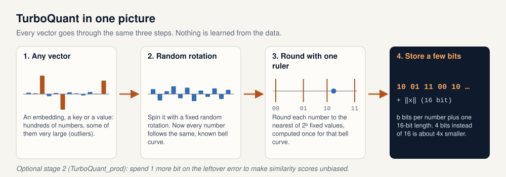

TurboQuant (Zandieh, Daliri, Hadian and Mirrokni, arXiv:2504.19874, April 2025) is a **vector quantizer**: an algorithm that maps a vector of real numbers to a short string of bits, and back to an approximation of the original. The authors designed it for two workloads that look different but share the same bottleneck:

* **LLM inference.** While a language model generates text, it keeps a *key-value (KV) cache* with two vectors for every past token, in every layer and every attention head. This cache, not the model's arithmetic, is what limits context length and the number of concurrent users. Section 1.1 explains the KV cache from scratch.
* **Vector search.** Vector databases, semantic search and retrieval-augmented generation (RAG) keep millions of embedding vectors in memory and compare a query against all of them.

In both cases what really matters is preserving **inner products** (similarity scores) between vectors. TurboQuant compresses vectors so that their inner products and distances stay accurate, and it does so with three properties that are rarely found together:

| Property | What it means in practice |
|---|---|
| **Data-oblivious (online)** | Nothing is learned from the data. A vector can be compressed the instant it is produced, which is exactly what a KV cache needs. |
| **Near-optimal** | The paper proves that no quantizer of any kind can do much better: TurboQuant's error is within a factor of about 2.7 of the information-theoretic limit, and within 1.45x at 1 bit. |
| **Accelerator-friendly** | Encoding is one matrix multiplication plus a table lookup, so it vectorizes well on GPUs and CPUs. |

> **What "near-optimal" means here.** Information theory sets a floor: with *b* bits per coordinate, no quantizer, however clever, can get a mean squared error below about 1/4ᵇ for unit vectors (0.25 at 1 bit, 0.0625 at 2 bits). The paper proves that TurboQuant's error is never more than √3·π/2 ≈ 2.7 times that floor. At 1 bit the gap is smaller still: TurboQuant gets about 0.36 against the floor of 0.25, which is 1.45 times. So even a perfect quantizer invented in the future could cut the error by a factor of 2.7 at most, and in practice the measured gap is around 1.4 to 2.4x (see the table in section 3.6). There is little left to gain by searching for a better method.

### 1.1 Background: how the KV cache works

> **In plain words.** A chatbot writes its answer one word at a time, and before each new word it rereads everything written so far. The KV cache is the model's notebook: it keeps a short summary of every word it has already read, so it never has to reread from scratch. It makes answers fast, but the notebook grows with every word and every user, and that is the memory TurboQuant shrinks.

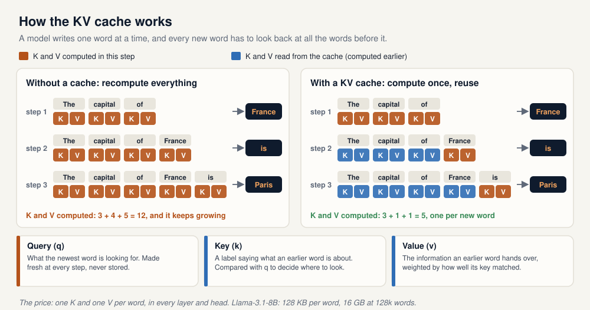

A language model generates text one token (roughly, one word) at a time. To pick the next token, every layer of the model runs **attention**, which works like a lookup:

* the newest token produces a **query** (q): what it is looking for;
* every earlier token has a **key** (k): a label saying what that token is about;
* every earlier token also has a **value** (v): the information it hands over.

The query is compared with every key, and the values of the tokens that match best are blended together to decide what comes next.

The figure follows *"The capital of"* as the model writes *"France"*, *"is"* and *"Paris"*. **Without a cache** (left), each step recomputes the keys and values of the whole sentence: 3, then 4, then 5, so the work keeps growing with the length of the text. But the key and value of a token never change once computed. **With a KV cache** (right), the model stores them and, at each step, computes the key and value of the newest token only, then reads the rest from memory: 3, then 1, then 1.

That saved work is why every LLM server uses a KV cache. The cost moves from computation to **memory**: one key and one value per token, in every layer and every attention head, for every conversation being served. The next subsection puts a number on it.

### 1.2 Why memory is the bottleneck

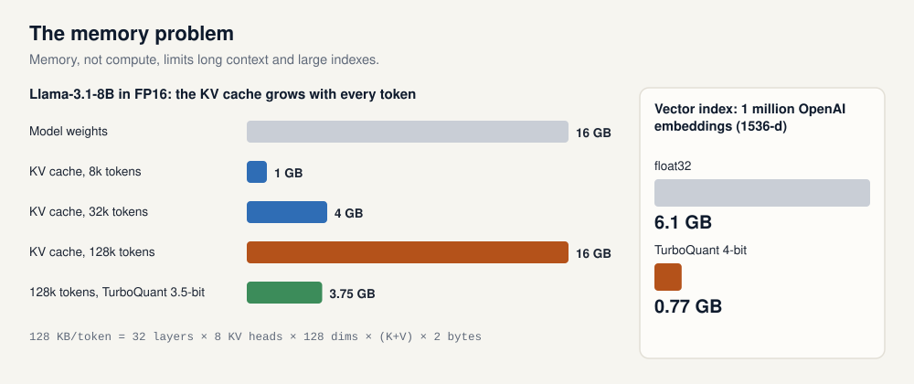

**LLM KV cache.** For Llama-3.1-8B in FP16, every token needs

`32 layers × 8 KV heads × 128 dimensions × 2 (key and value) × 2 bytes = 128 KB`

of cache. A 128k-token context therefore needs **16 GB**, as much as the model weights. Every generated token re-reads the whole cache from GPU memory, and that memory traffic, not computation, sets the speed of decoding. Less memory per token means longer contexts, more users per GPU, and faster attention once the kernels read compressed data directly.

**Vector index.** One million OpenAI `text-embedding-3-large` vectors (1536 dimensions, float32) take **6.1 GB**. Product quantization can shrink that, but it must first train codebooks with k-means and retrain them when the data changes. At 4 bits, TurboQuant stores the same index in about **0.77 GB** with no training at all.

### 1.3 Quantization in one minute

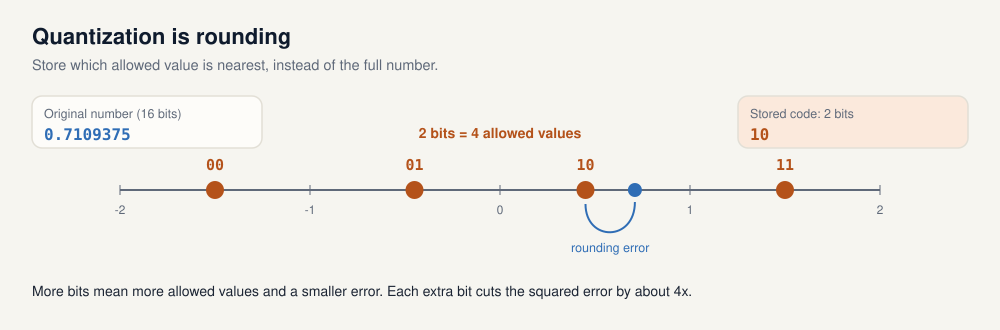

Quantization means **rounding**. Instead of storing a number exactly, you store which of a few allowed values it is closest to. With *b* bits you can name 2ᵇ allowed values: 4 values with 2 bits, 16 with 4 bits. The difference between the original and the rounded value is the *quantization error*. Two questions decide how good a quantizer is:

1. **Where do you put the allowed values?** If they sit where the data actually is, the error is small.
2. **What extra information do you need to store?** Most methods must also store, for every small block of numbers, a *scale* and a *zero point* so they know how to stretch the allowed values over that block's range. As section 1.5 shows, that bookkeeping can cost as much as a full extra bit per number.

TurboQuant's answer to both questions is the same trick: **rotate the vector randomly first**. After the rotation, every coordinate follows the same known distribution, so the best allowed values can be computed once, in advance, for all data, and there is no per-block scale to store.

### 1.4 How quantization works, step by step

> **In plain words.** Quantizing is like giving every number a short nickname. You agree in advance on a few allowed values, replace each number with the code of the closest one, and store only the codes. To read the data back, you swap each code for its value. You lose a little precision and save a lot of memory.

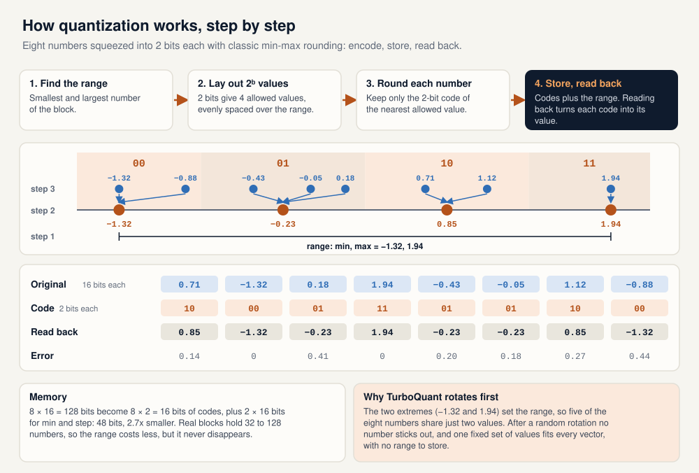

The figure follows eight numbers through the classic recipe used by INT8 and INT4 quantizers (*min-max*, or *uniform*, quantization) at 2 bits per number:

1. **Find the range.** Look at the block of numbers and note the smallest (−1.32) and the largest (1.94).
2. **Lay out 2ᵇ allowed values.** With 2 bits there are 4 codes: 00, 01, 10 and 11. Their values are spread evenly over the range, one *step* apart: −1.32, −0.23, 0.85 and 1.94 (step = 3.26 / 3 = 1.09). Each code owns the stretch of the line that is closest to its value.
3. **Round each number.** Replace every number with the code of the nearest allowed value: 0.71 becomes `10`, −0.43 becomes `01`, and so on. This is the only step that loses information.
4. **Store, then read back.** Store the codes packed tightly (eight 2-bit codes fit in 16 bits), plus the minimum and the step, which are needed to decode. Reading back is one multiply-add per number: value = minimum + code × step.

The last row of the table is the price: each number comes back slightly off, by at most half a step (0.44 here). More bits give more allowed values, a smaller step and a smaller error: every extra bit halves the step and cuts the squared error by about 4x.

Two weaknesses of this recipe explain the rest of the guide:

* **The range is overhead.** The minimum and the step are stored in 16-bit precision for every block. In the figure they cost 32 bits on top of 16 bits of codes. Real blocks are larger, but with blocks of 32 numbers the range still adds a full bit per number (section 1.5).
* **Outliers waste the allowed values.** The two extreme numbers decide the range, so the allowed values are spread thinly and five of the eight numbers have to share just two of them. Real keys and embeddings have exactly such outlier coordinates (section 3.5).

TurboQuant keeps steps 3 and 4 and replaces steps 1 and 2. A random rotation first spreads each vector evenly over its coordinates, so no number sticks out and every coordinate follows the same known bell curve. The allowed values are computed once for that bell curve (the Lloyd-Max codebook, section 3.2): they sit closer together where numbers are common, and they are the same for every vector, so no range is stored, only one 16-bit length per vector.

### 1.5 The hidden tax of classic quantization

> **In plain words.** Ordinary compression of numbers needs a small "legend" for every block of 32 numbers, saying how to read them. That legend is stored at full precision and, at low bit-widths, it can take a third of the total space. TurboQuant needs no legend, only one number per vector.

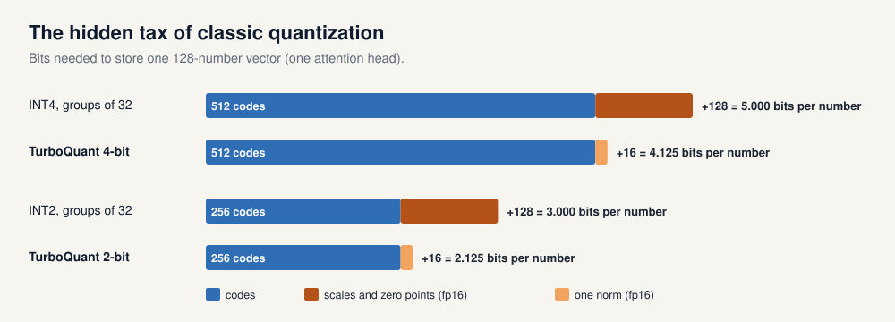

A standard block quantizer (KIVI-style INT-*b*, or Hugging Face's `QuantizedCache`) splits a vector into groups of, say, 32 numbers. For each group it stores the minimum (zero point) and the step size (scale) in fp16, then each number as a *b*-bit integer. For a 128-number attention head:

| Scheme | Code bits | Overhead | Effective bits per number |
|---|---|---|---|
| FP16 | 16 | 0 | 16 |
| INT4, scale + zero per 32 | 4 | 32 bits / 32 numbers = 1.0 | **5.0** |
| INT2, scale + zero per 32 | 2 | 1.0 | **3.0** |
| TurboQuant 4-bit | 4 | one fp16 norm / 128 = 0.125 | **4.125** |
| TurboQuant 2-bit | 2 | 0.125 | **2.125** |

At 2 bits the classic overhead is a 50% tax. TurboQuant only stores the vector's length (its L2 norm) in fp16, because after the rotation every block has the same, known range.

### 1.6 Results at a glance

| Claim | Source |
|---|---|
| KV cache at **3.5 bits per channel** scores the same as the uncompressed cache on LongBench (50.06 vs 50.06, Llama-3.1-8B-Instruct). | Paper, Table 1 |
| At **2.5 bits** the LongBench average drops only from 50.06 to 49.44. | Paper, Table 1 |
| Needle-in-a-haystack recall of **0.997** at 4x compression, identical to full precision, from 4k to 104k tokens. | Paper, Figure 4 |
| Vector search: higher recall than product quantization and RaBitQ on GloVe-200, OpenAI3-1536 and OpenAI3-3072, with indexing time of **0.0013 s** vs **240 s** for PQ (100k vectors, d = 1536, 4 bits). | Paper, Table 2 and Figure 5 |
| Up to **8x** faster attention-logit computation with 4-bit keys on H100. | Google Research blog |
| **2.3x to 3.7x** more KV-cache capacity in vLLM, at 66% to 80% of BF16 throughput. | vLLM blog |

The LongBench and needle numbers are on different scales: the first is an average task score out of 100, the second a recall score between 0 and 1. Section 5.2 explains what each one measures.

---

## 2. Three papers, one idea

> **In plain words.** TurboQuant is the third paper in a short series from the same Google Research group. All three use the same basic trick: scramble the data with a random transformation first, so that whatever the input looked like, the scrambled numbers follow a pattern that is known in advance. A known pattern can be compressed efficiently without studying the data.

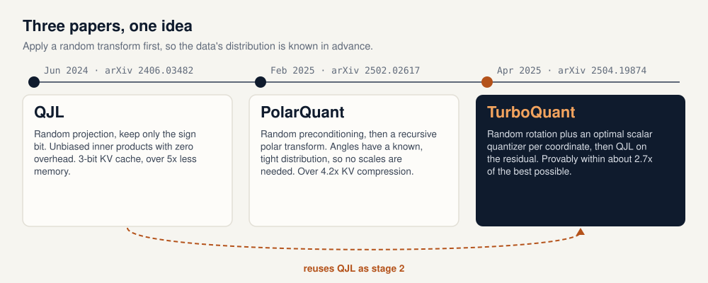

### 2.1 QJL: 1-bit quantized Johnson-Lindenstrauss (June 2024)

*Zandieh, Daliri, Han. arXiv:2406.03482.*

**The observation that started the series.** Classic KV-cache quantizers (KIVI, KVQuant and others) group numbers into blocks and store a full-precision scale and zero point per block. Depending on the block size, this "memory overhead" adds **1 to 2 extra bits per quantized number**.

**The idea.** Multiply the key vector by a random Gaussian matrix *S* (a Johnson-Lindenstrauss projection) and keep only the **sign** of each result: one bit per coordinate, plus the vector's norm. Nothing else has to be stored.

**The estimator.** To compute an attention score ⟨q, k⟩, QJL applies the same random projection to the query *without* quantizing it, and combines it with the stored signs. This *asymmetric* estimator is **unbiased**: on average it gives exactly the right inner product.

Section 4.1 works through QJL by hand on a four-number key.

**Results.** A 3-bit KV cache with more than **5x** lower memory and no loss of accuracy, with a CUDA kernel that is faster than the baseline.

**Role in TurboQuant.** QJL becomes TurboQuant's optional second stage: one sign bit per coordinate, applied to the leftover error.

### 2.2 PolarQuant (February 2025)

*Han, Kacham, Karbasi, Mirrokni, Zandieh. arXiv:2502.02617.*

**The idea.** Apply a random preconditioning (rotation), then convert the vector to **polar coordinates** with a recursive transform: pairs of coordinates become a radius and an angle, the radii are paired again, and so on for log₂ d levels (4 levels in practice). Quantize the angles.

**Why it works.** After random preconditioning, the angles have a distribution whose shape can be computed analytically (Lemma 2 of the paper). First-level angles are uniform over 0 to 2π. Angles at level ℓ ≥ 2 lie in 0 to π/2 with density proportional to sin^(2^(ℓ−1) − 1)(2ψ): centred on π/4 (45°) and tighter at each level. Because the distribution is known, there is no need to normalize each block, so no scales or zero points are stored. The paper uses 4 bits for the first-level angles and 2 bits for the higher levels, because the first-level range is four times wider.

Section 4.2 works through PolarQuant by hand on the same four numbers.

**Results.** Over **4.2x** KV-cache compression with the best quality scores among the methods compared on long-context benchmarks.

**Role in TurboQuant.** Google's blog describes TurboQuant's first stage as "PolarQuant-style" compression. In the TurboQuant paper itself, that stage keeps PolarQuant's principle (rotate first, so the distribution is known in advance and no per-block scales are needed) but drops the polar transform: it quantizes each rotated coordinate with a scalar Lloyd-Max quantizer (section 3), which is simpler and has a proven distortion bound.

### 2.3 TurboQuant (April 2025)

*Zandieh, Daliri, Hadian, Mirrokni. arXiv:2504.19874.*

TurboQuant simplifies and generalizes the two earlier works:

1. **TurboQuant_mse** (Algorithm 1): random rotation, then an *optimal* scalar quantizer (Lloyd-Max) for each coordinate. It minimizes the mean squared error (MSE).
2. **TurboQuant_prod** (Algorithm 2): TurboQuant_mse with one bit fewer, then 1-bit QJL on the residual. It gives **unbiased** inner products.
3. **Matching lower bounds**: a proof, using Shannon's lower bound and Yao's minimax principle, that no quantizer can beat 4⁻ᵇ distortion, so TurboQuant is within a small constant of optimal.
4. **Experiments** on KV-cache compression (needle in a haystack, LongBench with Llama-3.1-8B-Instruct and Ministral-7B-Instruct) and nearest-neighbour search (DBpedia OpenAI3 embeddings, GloVe).

Section 4.3 runs TurboQuant end to end on the same four numbers, once section 3 has explained each step.

| | QJL | PolarQuant | TurboQuant |
|---|---|---|---|
| Random transform | Gaussian projection | Random preconditioning | Random rotation |
| What gets quantized | Sign of each projected coordinate | Polar angles | Each rotated coordinate (+ residual signs) |
| Per-block scales stored | None | None | None |
| Bits | 1 per coordinate (keys) | about 3.9 per channel | any b; 2.5 and 3.5 with outlier split |
| Target | KV cache | KV cache | KV cache and vector search |
| Guarantee | Unbiased inner products | Analytic angle distribution | MSE and inner-product distortion within ≈2.7x of the lower bound |

---

## 3. How TurboQuant works

### 3.1 Step 1: random rotation

> **In plain words.** Imagine a vector as an arrow in a space with hundreds of directions. Rotating the arrow does not change its length or the angles between arrows, so no information is lost. But it spreads the arrow's "energy" evenly over all coordinates, so no single coordinate is huge any more.

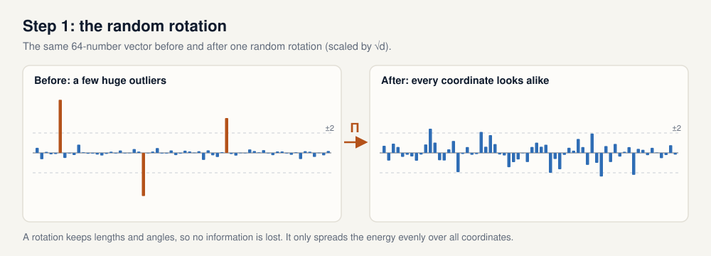

TurboQuant first divides the vector by its norm and multiplies it by a fixed random orthogonal matrix Π (drawn once from a seed and shared by all vectors):

`y = Π · x / ‖x‖`

**Under the hood.** The rotated vector is a uniformly random point on the unit sphere. The paper's Lemma 1 gives the exact distribution of each of its coordinates, a scaled Beta distribution:

`f(x) ∝ (1 − x²)^((d−3)/2)` on [−1, 1]

In high dimensions this is very close to a normal distribution N(0, 1/d). Two facts make the rest of the algorithm work:

* **The distribution is known in advance and is the same for every coordinate and every input.** Outlier channels, which plague KV caches, are spread out by the rotation.
* **Distinct coordinates are nearly independent** (not just uncorrelated) in high dimensions. So quantizing each coordinate on its own, ignoring the others, is close to optimal for the whole vector.

In `turboquant_core.py`, `random_rotation(d, seed)` builds Π from the QR decomposition of a Gaussian matrix, with a sign correction so the rotation is uniformly (Haar) distributed.

### 3.2 Step 2: one fixed ruler (the Lloyd-Max codebook)

> **In plain words.** Since every rotated coordinate follows the same bell curve, the best set of allowed values ("the ruler") can be computed once and reused for everything. More allowed values go where the curve is high, where most numbers fall.

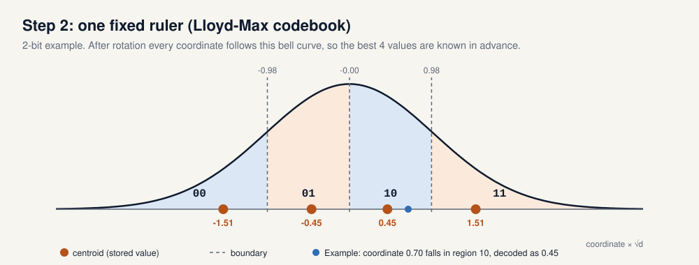

For a bit-width *b*, TurboQuant needs 2ᵇ *centroids* (allowed values) that minimize the expected squared rounding error for the Beta distribution above. That is a one-dimensional continuous k-means problem, solved with the classic **Lloyd-Max algorithm**: alternate between placing boundaries halfway between centroids, and moving each centroid to the mean of the probability mass in its cell.

For d = 128, the centroids, in units of 1/√d, are:

| Bits | Centroids × √d |
|---|---|
| 1 | ±0.80 |
| 2 | ±0.45, ±1.51 |
| 3 | ±0.24, ±0.75, ±1.34, ±2.13 |

Each rotated coordinate is replaced by the index of its nearest centroid (`torch.bucketize` against the boundaries). The codebooks depend only on *d* and *b*, so they are computed once (`lloyd_max_codebook`, cached) and never retrained.

### 3.3 Encoding and decoding, end to end

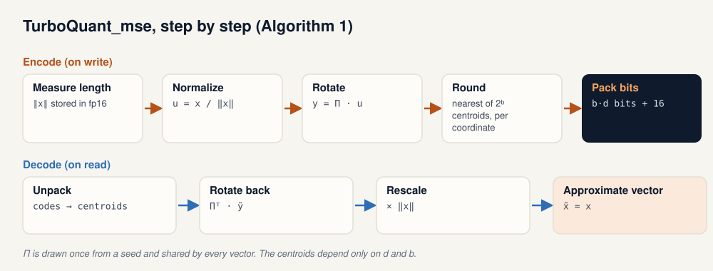

**Encode** (`TurboQuant.quantize`): store ‖x‖ in fp16, normalize, rotate, round each coordinate to its nearest centroid, and bit-pack the indices. Storage: **b·d bits + 16 bits** per vector.

**Decode** (`TurboQuant.dequantize`): unpack the indices, look up the centroids, rotate back with Πᵀ, and multiply by the stored norm.

**Under the hood.** For search, decoding is not even necessary. Because rotations preserve inner products, `⟨q, x̃⟩ = ‖x‖ · ⟨Π·q, c[idx]⟩`: rotate the query once and score it directly against the centroid values of every stored vector. The vector-search notebook does exactly that (`TurboQuantSearch.search`), and fused GPU kernels use the same identity to compute attention scores directly from the packed codes.

The `renorm=True` option rescales the reconstruction so its norm matches the stored one. This cheap *norm correction* is similar in spirit to the `_nc` variants in vLLM.

### 3.4 Stage 2: unbiased inner products (TurboQuant_prod)

> **In plain words.** Rounding to the nearest allowed value tends to make vectors a little shorter, so similarity scores come out slightly too low on average. TurboQuant can spend one of its bits on a tiny "correction sketch" of the rounding error. The scores are then right on average, at the cost of some extra noise.

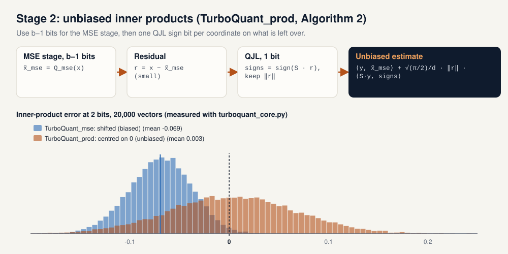

**The problem.** An MSE-optimal quantizer is **biased** for inner products: it shrinks vectors toward the centroids, so ⟨y, x̃⟩ underestimates ⟨y, x⟩. At 1 bit the expected estimate is (2/π)·⟨y, x⟩, a 36% underestimate. In the LLM notebook's theory check (d = 128, 20,000 vectors) the measured bias is about −36% at 1 bit, −12% at 2 bits and −3.5% at 3 bits.

**The fix** (Algorithm 2):

1. Quantize with TurboQuant_mse using **b − 1** bits: x̃_mse.
2. Compute the residual r = x − x̃_mse. It is small.
3. Apply QJL to the residual: store sign(S·r) (1 bit per coordinate) and ‖r‖ (fp16).
4. Estimate: `⟨y, x̃_mse⟩ + √(π/2)/d · ‖r‖ · ⟨S·y, sign(S·r)⟩`.

Section 4.3 runs these four steps on a 4-dimensional example with real numbers.

The paper's Theorem 2 proves this estimator is **unbiased** for any y, with inner-product error at most `√3·π²·‖y‖²/d · 4⁻ᵇ`.

**The trade-off.** Unbiased is not the same as more accurate. The QJL bit adds variance, and the MSE stage has one bit less. At low bit-widths the unbiased version wins; from about 3 bits up, plain TurboQuant_mse has lower total error. The paper's Figure 3 shows the crossover, and the figure above shows it for 2 bits: the MSE errors are shifted left (biased), the prod errors are centred on zero but wider.

**Practical consequence for LLMs.** Attention passes scores through a softmax, which amplifies noise. That is a likely reason why production KV-cache implementations (vLLM) use the MSE variant with norm correction rather than the QJL variant. This is our inference from the measurements and from what vLLM ships, not a claim made in the paper.

### 3.5 Outlier channels and fractional bit-widths

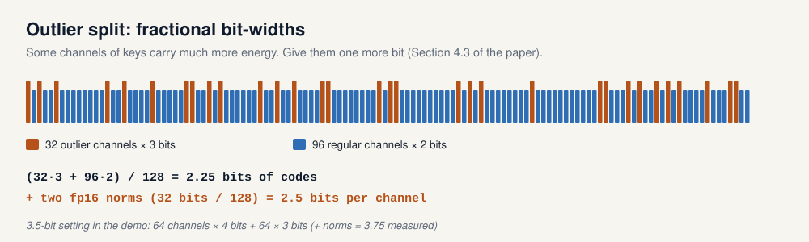

Keys in real LLMs have a few channels with much larger magnitude than the rest. Following earlier work, the paper splits the channels of each head into an outlier set and a regular set and runs **two independent TurboQuant instances**, giving the outliers one extra bit. That is where the paper's **2.5-bit** and **3.5-bit** settings come from:

* 2.5 bits: 32 outlier channels at 3 bits + 96 channels at 2 bits. The codes alone are (32·3 + 96·2)/128 = 2.25 bits per channel. Adding the two fp16 norms gives exactly **2.5** bits per channel measured.
* 3.5-bit setting in the demo: 64 channels at 4 bits + 64 at 3 bits = 3.5 bits of codes, **3.75** measured with norms.

`MixedTurboQuant` implements this. Its `calibrate` method picks the outlier channels as those with the largest mean absolute value on a sample (the prefill).

### 3.6 How close to optimal?

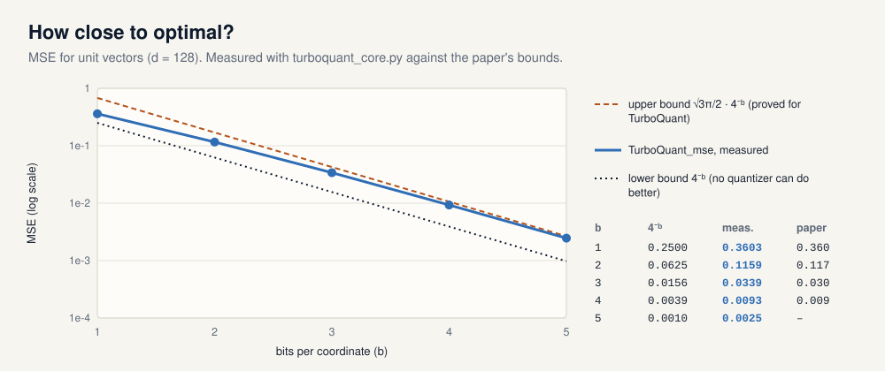

The paper proves bounds that sandwich TurboQuant's error for unit vectors:

| MSE, unit vectors | b = 1 | b = 2 | b = 3 | b = 4 |
|---|---|---|---|---|
| Lower bound, any quantizer: 4⁻ᵇ | 0.250 | 0.063 | 0.016 | 0.0039 |
| **Measured with `turboquant_core.py`** (d = 128) | **0.360** | **0.116** | **0.034** | **0.0093** |
| Paper | 0.36 | 0.117 | 0.03 | 0.009 |
| Upper bound for TurboQuant: √3π/2 · 4⁻ᵇ | 0.680 | 0.170 | 0.043 | 0.0106 |

* Each extra bit divides the error by 4, which is the best rate any quantizer can achieve.
* The gap to the lower bound is never more than √3π/2 ≈ 2.7x, and only 1.45x at 1 bit.
* Earlier data-oblivious methods only had loose guarantees.

The reference implementation reproduces the paper's numbers. The core sanity test from `CURSOR_HANDOFF.md` (T1) passed on the workshop machine with MSE 0.3607 / 0.116 / 0.034 / 0.0093 for 1 to 4 bits, and checks bit-packing round trips for 1 to 5 bits.

### 3.7 The algorithm in code

The reference implementation (`turboquant_core.py`, about 400 lines of PyTorch) maps directly to the paper:

| Paper | `turboquant_core.py` |
|---|---|
| Lemma 1, Eq. (4): optimal scalar quantizer for the Beta distribution | `lloyd_max_codebook(d, bits)` |
| Theorem 1: d·C(f_X, b) | `codebook_mse_cost(d, bits)` |
| Random rotation Π | `random_rotation(d, seed)` |
| Algorithm 1, TurboQuant_mse | `TurboQuant(d, bits, mode="mse")` |
| Algorithm 2, TurboQuant_prod | `TurboQuant(d, bits, mode="prod")` |
| Outlier split (Section 4.3) | `MixedTurboQuant(d, n_out, bits_hi, bits_lo)` |
| Baseline: INT-b with scale and zero per group | `UniformQuant(d, bits, group=32)` |
| b·d bits per vector, measured | `pack_bits`, `unpack_bits`, `nbytes` |
| KV cache integration | `TurboQuantCache` (Hugging Face transformers v5) |

```python
import torch
from turboquant_core import TurboQuant

q = TurboQuant(d=128, bits=4, mode="mse", seed=0)
x = torch.randn(1000, 128)
c = q.quantize(x)            # packed codes + fp16 norms
x_hat = q.dequantize(c)      # approximate vectors
print(c.nbytes() / 1000)     # 66 bytes per vector instead of 256 in fp16
```

---

## 4. Worked examples: the three methods by hand

> **In plain words.** The three methods are easiest to follow on numbers small enough to check with a calculator. All three examples use the same four-number vector `v = [3, −4, 2, 0.5]` and the same query `q = [1, −1, 1, 0]`, whose exact score is 9, so their results can be compared directly. Every number comes from `docs/guide/worked_examples.py`.

### 4.1 QJL by hand

Take a 4-dimensional key (real keys have 64 to 128 dimensions per head) and project it to m = 3 bits. Three bits is far too few to be accurate; it only keeps the arithmetic short.

1. **Key and norm.** `k = [3, −4, 2, 0.5]`, so `‖k‖ = √(9 + 16 + 4 + 0.25) = √29.25 ≈ 5.41`. The norm is stored as one float.
2. **Random Gaussian matrix.** Each entry of *S* (here 3 × 4) is drawn from a standard normal distribution. Suppose the draw is:

   ```
   S = [  0.5  −0.2   0.8  −0.1 ]
       [ −0.9   0.1   0.3   0.7 ]
       [  0.2   0.6  −0.4  −0.5 ]
   ```

   *S* is not stored either: it is regenerated from a shared random seed whenever it is needed.
3. **Project.** `S·k`, row by row:
   * 0.5·3 + (−0.2)·(−4) + 0.8·2 + (−0.1)·0.5 = 1.5 + 0.8 + 1.6 − 0.05 = **3.85**
   * (−0.9)·3 + 0.1·(−4) + 0.3·2 + 0.7·0.5 = −2.7 − 0.4 + 0.6 + 0.35 = **−2.15**
   * 0.2·3 + 0.6·(−4) + (−0.4)·2 + (−0.5)·0.5 = 0.6 − 2.4 − 0.8 − 0.25 = **−2.85**
4. **Keep the signs.** `sign(S·k) = [+1, −1, −1]`, stored as the bits `100` (1 means +1, 0 means −1).

What stays in memory for this key: 3 bits plus one float (5.41). The original four floats are discarded.

**Using the bits.** A query arrives, say `q = [1, −1, 1, 0]`. To score it we only have the key's 3 bits and its norm; the steps below show where each number comes from.

5. **Exact score (the reference).** The dot product multiplies `q` and `k` coordinate by coordinate and adds the results:

   `⟨q, k⟩ = 1·3 + (−1)·(−4) + 1·2 + 0·0.5 = 3 + 4 + 2 + 0 = 9`

   The second term is +4 because the two minus signs cancel, and the last term is 0 because the query has no component along the fourth coordinate. This 9 is the value the estimator tries to recover without having `k` in memory.
6. **Project the query.** The query is projected with the same *S* but **not** quantized. `S·q`, row by row (as in step 3, with `q` in place of `k`):
   * 0.5·1 + (−0.2)·(−1) + 0.8·1 + (−0.1)·0 = 0.5 + 0.2 + 0.8 + 0 = **1.5**
   * (−0.9)·1 + 0.1·(−1) + 0.3·1 + 0.7·0 = −0.9 − 0.1 + 0.3 + 0 = **−0.7**
   * 0.2·1 + 0.6·(−1) + (−0.4)·1 + (−0.5)·0 = 0.2 − 0.6 − 0.4 + 0 = **−0.8**

   So `S·q = [1.5, −0.7, −0.8]`.
7. **Combine with the bits.** QJL's estimator is

   `⟨q, k⟩ ≈ √(π/2) / m · ‖k‖ · ⟨S·q, sign(S·k)⟩`

   and it is computed term by term:
   * **`⟨S·q, sign(S·k)⟩`.** Each query projection is multiplied by the stored sign of the same row (the bits `100` are +1, −1, −1) and the results are added: `1.5·(+1) + (−0.7)·(−1) + (−0.8)·(−1) = 1.5 + 0.7 + 0.8 = 3.0`. In all three rows the query's projection has the same sign as the key's, so all three terms add; a row with opposite signs would subtract.
   * **`√(π/2) / m`.** `√(π/2) = √1.5708 ≈ 1.2533`, and dividing by m = 3 gives `≈ 0.4178`.
   * **`‖k‖`.** The norm stored in step 1: `5.41`.
   * **Product.** `0.4178 · 5.41 · 3.0 ≈ 6.78`, against a true value of 9.

Three points the example makes concrete:

* **Why √(π/2).** For a Gaussian row s, the average of `⟨s, q⟩ · sign(⟨s, k⟩)` is `√(2/π) · ⟨q, k⟩ / ‖k‖`. Multiplying by `√(π/2) · ‖k‖` cancels that factor, which is what makes the estimator unbiased. The norm restores the magnitude the signs threw away, and √(π/2) undoes the shrinkage that taking signs causes.
* **Unbiased does not mean exact.** One draw of *S* gave 6.78. Averaged over 2,000 random draws of *S*, the estimate for this same pair is 9.07 with a standard deviation of 4.4 at m = 3, 0.91 at m = 64, and 0.24 at m = 1,024. The error shrinks like 1/√m, which is why real use projects to as many bits as the head dimension or more.
* **No XOR or popcount.** Because the query stays in full precision, the score is a sum of the query's projections with signs flipped by the stored bits, not a Hamming distance. XOR plus popcount belongs to the symmetric scheme where both vectors are reduced to signs (SimHash): the fraction of differing bits estimates the angle between them divided by π. That variant is cheaper but adds the query's quantization error, and QJL avoids it on purpose. The bits record the key's direction on the ordinary Euclidean unit sphere; no hyperbolic geometry is involved.

In TurboQuant the same recipe runs on the residual `r` left by the first stage, so the stored norm is `‖r‖` rather than `‖k‖` (section 3.4).

### 4.2 PolarQuant by hand

Take a 4-dimensional vector that has already been rotated, `v = [3, −4, 2, 0.5]` (real heads have 128 dimensions). With d = 4 the tree has log₂ 4 = 2 levels:

```
Level 2 (root):          ‖v‖ = 5.41      angle ψ = 22.4°   (range 0 to 90°)
                        /          \
Level 1:            R_A = 5      R_B = 2.06
                    θ₁ = 306.9°  θ₂ = 14.0°               (range 0 to 360°)
                    /    \        /    \
Input:            x₁=3  x₂=−4   x₃=2  x₄=0.5
```

1. **Level 1: pair the coordinates.** `(x₁, x₂) = (3, −4)` becomes a radius `R_A = √(9 + 16) = 5` and an angle `θ₁ = atan2(−4, 3) = −53.1°`, taken as 306.9° so it falls in 0 to 360°. `(x₃, x₄) = (2, 0.5)` becomes `R_B = √4.25 = 2.06` and `θ₂ = atan2(0.5, 2) = 14.0°`.
2. **Level 2: pair the radii.** `(R_A, R_B)` becomes the radius `√(25 + 4.25) = 5.41`, which is the norm of the whole vector, and the angle `ψ = arctan(R_B / R_A) = 22.4°`. Both radii are non-negative, so ψ is always between 0 and 90°.
3. **Quantize the angles.** Level 1 uses 4 bits, 16 buckets of 22.5° whose centres are 11.25°, 33.75°, …: θ₁ = 306.9° falls in bucket 13 (centre 303.75°), θ₂ = 14.0° in bucket 0 (centre 11.25°). Level 2 uses 2 bits. Its four centroids come from 1-D k-means on the level-2 density (the paper builds them with k-means++), which gives 17.7°, 36.3°, 53.7° and 72.3°: ψ = 22.4° becomes 17.7°, index 0.

What stays in memory: 4 + 4 + 2 = 10 bits of angle indices plus one float (5.41). The original four floats are discarded.

**Decoding** runs the tree top-down with cosines and sines: `R_A ≈ 5.41·cos 17.7° = 5.15`, `R_B ≈ 5.41·sin 17.7° = 1.65`, then `v̂ = [5.15·cos 303.75°, 5.15·sin 303.75°, 1.65·cos 11.25°, 1.65·sin 11.25°] = [2.86, −4.28, 1.62, 0.32]`. The relative error is 9.7%; with the query `q = [1, −1, 1, 0]` the score is 8.76 against an exact 9.

Four points the example makes concrete:

* **How tight the higher levels are.** The density at level 2 is just sin 2ψ, which is broad: its standard deviation is 19.6°, against 26.0° for a uniform angle on the same range. It narrows to 14.2° at level 3 and 10.1° at level 4. The 2-bit centroids follow it: 17.7° to 72.3° at level 2, 30.0° to 60.0° at level 4.
* **One radius per block, not per vector.** In practice the recursion stops after L = 4 levels, so each block of 16 coordinates keeps one 16-bit radius. A block stores 8 angles × 4 bits + 4 × 2 + 2 × 2 + 1 × 2 = 46 bits plus the radius: 62 bits for 16 numbers, or **3.875 bits per coordinate**, about 4.1x smaller than 16-bit floats. A 128-dimensional head has 8 such radii. The only other state is the small codebook of centroids, shared by every vector rather than stored per block. The abstract's "over 4.2x" is the paper's own headline; it is slightly above what this 3.875-bit accounting gives, and the paper keeps generated tokens in full precision in its LongBench runs.
* **The codebook is fitted once, not per vector.** The angle distribution is known in theory, but the paper fits the centroids by 1-D k-means++ on observed angles, either online (once per prompt and layer, during prefill) or offline (one codebook for all prompts, layers and heads). The online variant scores slightly better.
* **What the rotation buys.** For the analysis the paper multiplies by a matrix with i.i.d. Gaussian entries; in the implementation it uses a random rotation shared by all layers, heads, keys and values. Fast random Hadamard transforms play the same role in other work, but they are not what PolarQuant used. In a check on heavy-tailed synthetic vectors (d = 128, 2,000 vectors, the codebooks above), the relative squared error was 3.2% with the rotation and 13.6% without it.

### 4.3 TurboQuant end to end

The same vector and query as in sections 4.1 and 4.2, `v = [3, −4, 2, 0.5]` and `q = [1, −1, 1, 0]` with exact score `⟨q, v⟩ = 9`, now run through TurboQuant_prod at b = 3 bits per coordinate: a 2-bit MSE stage plus the 1-bit QJL stage. Every number below comes from `docs/guide/worked_examples.py`. Sections 3.1 to 3.4 explain each step in detail.

1. **Norm.** `‖v‖ = √29.25 ≈ 5.41`, stored as one fp16 number. The rest works on the direction `u = v / ‖v‖ = [0.555, −0.740, 0.370, 0.092]`.
2. **Rotate.** For arithmetic that fits on a page, the rotation is a 4 × 4 Hadamard matrix with random column signs (+, −, +, −), divided by 2 so that it is orthogonal. This is a fast random rotation; `turboquant_core.py` uses a dense random rotation from a QR decomposition instead.

   ```
   Π = ½ · [ 1  −1   1  −1 ]
           [ 1   1   1   1 ]
           [ 1  −1  −1   1 ]
           [ 1   1  −1  −1 ]
   ```

   `Π·v = ½·[3 + 4 + 2 − 0.5, 3 − 4 + 2 + 0.5, 3 + 4 − 2 + 0.5, 3 − 4 − 2 − 0.5] = [4.25, 0.75, 2.75, −1.75]`. The squares still add up to 29.25: the rotation changes the coordinates but not the length. Dividing by ‖v‖ gives `y = [0.786, 0.139, 0.508, −0.324]`.
3. **Round each coordinate with the fixed codebook.** For d = 4, each rotated coordinate of a unit vector follows the density `(1 − x²)^½` on [−1, 1] (Lemma 1 with d = 4). Its 2-bit Lloyd-Max codebook is `{−0.674, −0.219, +0.219, +0.674}`, with boundaries at −0.447, 0 and +0.447. So 0.786 → +0.674 (index 3), 0.139 → +0.219 (index 2), 0.508 → +0.674 (index 3) and −0.324 → −0.219 (index 1). Stored codes: `11 10 11 01`, 8 bits.
4. **Decode the MSE stage.** Rotate the centroids back and scale by the norm: `x̃_mse = ‖v‖ · Πᵀ·[0.674, 0.219, 0.674, −0.219] = [3.65, −3.65, 1.19, 1.19]`. The relative error is 24% (2 bits on 4 dimensions is very coarse) and the score is `⟨q, x̃_mse⟩ = 8.48`, below 9: the MSE stage shrinks the vector, which is the bias of section 3.4.
5. **Residual.** `r = v − x̃_mse = [−0.65, −0.35, 0.81, −0.69]`, with `‖r‖ = 1.29`, stored as a second fp16 number. The part of the score the MSE stage missed is `⟨q, r⟩ = 0.52`.
6. **QJL on the residual.** TurboQuant uses a square d × d Gaussian matrix *S*. Take the three rows of the QJL example and suppose the fourth row drawn is `[0.4, −0.7, −0.3, 0.9]`. Then `S·r = [0.47, 0.31, −0.32, −0.87]` and the signs `[+1, +1, −1, −1]` are stored as the bits `1100`.
7. **Estimate the score.** The query is projected with the same *S* but never quantized: `S·q = [1.5, −0.7, −0.8, 0.8]`, so `⟨S·q, sign(S·r)⟩ = 1.5 − 0.7 + 0.8 − 0.8 = 0.8`. The correction is `√(π/2)/4 · 1.29 · 0.8 = 0.32`, and the estimate is `8.48 + 0.32 = 8.81`, against a true value of 9.

What stays in memory: 8 bits of codes, 4 sign bits and two fp16 norms (‖v‖ and ‖r‖), 44 bits instead of the 64 bits of four fp16 numbers. The two norms dominate only because d = 4; at d = 128 and 3 bits a vector takes 384 + 32 = 416 bits instead of 2,048.

Three points the example makes concrete:

* **The QJL bit corrects the shrinkage on average.** Over 20,000 random rotations (each with its own draw of *S*), the MSE stage alone averages 8.32, a 7.5% underestimate, while the full estimate averages 9.00. The spread is slightly larger with the correction (standard deviation 1.43 against 1.29): unbiased, but noisier, as section 3.4 says.
* **One draw is not the average.** For this rotation, 2,000 draws of *S* give a mean of 8.99 with a standard deviation of 1.39. In real use d is 128, so the correction sums 128 sign bits and its spread is far smaller.
* **Nothing is fitted to the data.** The rotation and *S* come from seeds, and the codebook depends only on d and b. The only per-vector state is the codes, the sign bits and two norms.

---

## 5. Use case 1: LLM inference (the KV cache)

> **In plain words.** When a chatbot writes an answer, each new word has to look back at every word before it. To avoid recomputing everything, the model keeps a memory of all previous words, the KV cache. That memory grows with every word and every user. TurboQuant stores it about 4 to 6 times smaller, so the same GPU can handle longer documents or more users.

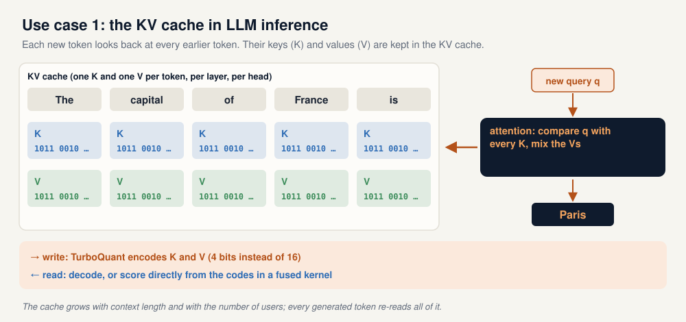

### 5.1 What the KV cache is

A transformer layer turns every token into a **query** (q), a **key** (k) and a **value** (v). To produce the next token, attention compares the new query with the keys of all previous tokens (inner products ⟨q, k⟩), turns those scores into weights with a softmax, and mixes the values with those weights. The keys and values of past tokens do not change, so the model caches them: one key and one value vector per token, per layer, per KV head. Section 1.1 walks through this step by step.

This is where TurboQuant fits:

* **On write**, each new key and value vector is rotated, quantized and bit-packed. This happens token by token during generation. No calibration pass is needed, which rules out most data-dependent methods.
* **On read**, either the codes are decoded back to vectors before attention (the reference implementation), or a fused kernel computes ⟨q, k⟩ directly from the codes (production).

Unlike KIVI and PolarQuant in the paper's comparison, TurboQuant also quantizes the tokens produced during generation, not only the prompt.

### 5.2 What the paper reports

**LongBench-E** (Llama-3.1-8B-Instruct, average over single-doc QA, multi-doc QA, summarization, few-shot, synthetic and code tasks):

| Method | KV bits | Average |
|---|---|---|
| Full cache | 16 | 50.06 |
| KIVI | 3 | 48.50 |
| KIVI | 5 | 50.16 |
| PolarQuant | 3.9 | 49.78 |
| **TurboQuant** | **2.5** | **49.44** |
| **TurboQuant** | **3.5** | **50.06** |

On Ministral-7B-Instruct, TurboQuant at 2.5 bits scores 49.62 against 49.89 for the full cache.

> **What LongBench-E is and what the score means.** LongBench (Bai et al., THUDM, 2023) is a long-context benchmark of question answering, summarization, few-shot, synthetic and code-completion tasks. LongBench-E is its length-balanced subset: 13 English and code datasets, resampled so that inputs of 0–4k, 4k–8k and 8k+ tokens appear in comparable numbers. That makes it suited to compression methods, whose damage can grow with context length. Every task is scored automatically from 0 to 100 with its own metric: F1 word overlap with the reference answer for most QA tasks, ROUGE-L for summaries, accuracy for classification and the synthetic tasks, and edit similarity for code. The **Average** is therefore a mean quality score, not a percentage of correct answers, and it only means something next to the full cache on the same model. It is not the mean of the six category columns in the paper's Table 1 (that would be about 48.5), so it is presumably the average over the individual datasets, which the paper does not list. A tied average is not a tie everywhere: at 3.5 bits TurboQuant is slightly lower than the full cache on single-document QA (45.01 vs 45.29) and slightly higher on multi-document QA (45.31 vs 45.16). The paper's text says LongBench-E while the Table 1 caption says LongBench-V1.

**Needle in a haystack** (Llama-3.1-8B-Instruct, documents of 4k to 104k tokens, 25% of the full cache memory):

| Method | Score |
|---|---|
| Full precision | 0.997 |
| **TurboQuant** | **0.997** |
| PolarQuant | 0.995 |
| KIVI | 0.981 |
| PyramidKV | 0.895 |
| SnapKV | 0.858 |

Token-eviction methods (SnapKV, PyramidKV) drop tokens they guess are unimportant and therefore miss needles. Quantization keeps every token, just with fewer bits.

> **What Needle in a Haystack is and what the score means.** The test (Kamradt, 2023) hides one sentence, the *needle*, at a chosen depth of a long filler document, the *haystack*, and asks the model to retrieve it. The paper follows the setup of Fu et al. (2024): document lengths from 4k to 104k tokens and needle depths from 0% to 100% of the document, which together form the heatmap grid in its Figure 4. Each cell gets a score from 0 to 1, and the number in the table is the average over the whole grid. The paper calls it a recall score, "how accurately the model retrieves the hidden sentence", without giving the formula. In the evaluation code most KV-cache papers reuse (KVCache-Factory, from the PyramidKV authors), each answer is scored by its word overlap with the needle (ROUGE-1), so a partly correct answer earns partial credit. Read 0.997 as "the answers reproduced the needle almost perfectly across all lengths and depths", not as "99.7% of tests passed". The memory condition matters as much as the score: every compressed method ran with 25% of the full cache. Demo 1 scores more strictly: a run counts as found only if the exact code appears in the answer (section 7.1).

### 5.3 In production

* **Google Research blog:** up to **8x** faster attention-logit computation with 4-bit TurboQuant keys versus 32-bit keys on H100, and at least 6x smaller KV memory on needle tasks with 3-bit keys.
* **vLLM** (0.20.2 and later) ships fused kernels: `--kv-cache-dtype turboquant_4bit_nc`, `turboquant_k8v4`, `turboquant_k3v4_nc`, `turboquant_3bit_nc`. vLLM's blog reports **2.3x to 3.7x** more KV-cache capacity at **66% to 80%** of BF16 throughput. The aggressive 3-bit variants lose up to about 20 points on hard math and coding tasks; FP8 remains the throughput-neutral option.

The honest summary: **the reliable win is capacity** (longer context, more concurrent requests per GPU). Speed depends on having fused kernels, and the most aggressive settings need evaluation on your own tasks.

> **What a fused kernel is.** A *kernel* is a function that runs on the GPU. Without fusion, a compressed cache needs one kernel that unpacks the codes and writes full-precision keys and values back to GPU memory, then the usual attention kernel that reads them again. The decompressed copy costs as much memory traffic as an uncompressed cache, plus the unpacking, so decoding gets slower. A *fused* kernel does both jobs in one pass: it reads the packed codes, rebuilds each key and value in on-chip registers, and computes ⟨q, k⟩, the softmax and the weighted sum of values without ever storing the decompressed cache. With TurboQuant it can even skip rebuilding the keys: rotate the query once and score it directly against the codebook values (section 3.3). Decoding is limited by memory traffic (section 1.2), so reading 3 or 4 bits per number instead of 16 is where the speedup comes from. `turboquant_core.py` is not fused, which is why it saves memory but decodes more slowly than FP16.

### 5.4 What compression buys

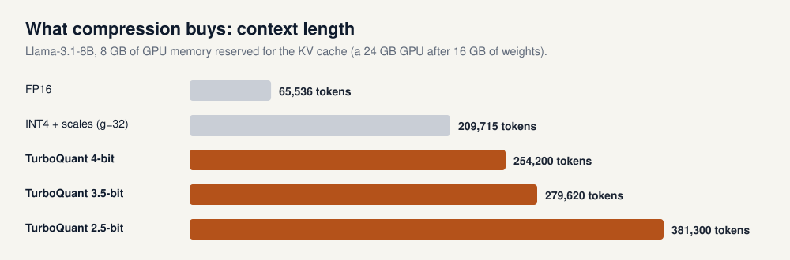

For Llama-3.1-8B with 8 GB of GPU memory set aside for the KV cache (a 24 GB GPU after 16 GB of weights):

| Cache | Bytes per token | Max context in 8 GB |
|---|---|---|
| FP16 | 128 KB | 65,536 tokens |
| INT4 + scale/zero (groups of 32) | 40 KB | 209,715 tokens |
| TurboQuant 4-bit | 33 KB | 254,200 tokens |
| TurboQuant 3.5-bit | 30 KB | 279,620 tokens |
| TurboQuant 2.5-bit | 22 KB | 381,300 tokens |

These figures come from the formula in section 5 of the LLM notebook and match the "Demo 1 · Memory" slide.

---

## 6. Use case 2: vector search and RAG

> **In plain words.** A vector database answers questions like "which of my million documents are most similar to this one?". It stores one vector per document and compares the question's vector against all of them. TurboQuant shrinks the stored vectors 8x to 16x and, unlike the usual method, does not need a slow training step first, so new documents can be added the moment they arrive.

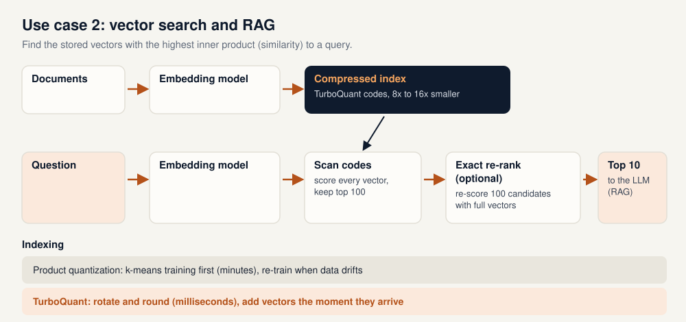

### 6.1 How vector search works

1. An **embedding model** turns each document (or image, or product) into a vector, such that similar items get vectors with a high inner product (cosine similarity, for normalized vectors).
2. The vectors are stored in an **index**.
3. A query is embedded with the same model and the index returns the **top-k** most similar vectors.
4. In **RAG**, those top-k documents are passed to an LLM as context.

For large collections the index must be compressed to fit in RAM. The standard tool is **product quantization (PQ)**: split each vector into sub-vectors and replace each sub-vector with the nearest of 256 (or 16) centroids learned with k-means. Section 6.4 explains how PQ works and how it compares with TurboQuant.

### 6.2 Why TurboQuant fits

* **No training.** PQ must run k-means before it can encode anything, and retrain when the data distribution drifts. TurboQuant's codebook is fixed in advance, so indexing is a matrix multiply and a bucket lookup.
* **Better recall at the same bits.** Because the rotation makes all coordinates alike, a single scalar codebook is near-optimal, and the paper finds that it beats PQ, even though PQ was trained on the very data it was evaluated on.
* **Fast scoring.** Rotate the query once, then score against centroid values (section 3.3). SIMD implementations such as `turbovec` make this faster than exact search.
* **Two-stage search.** Scan the compressed index for ~100 candidates, then re-score only those with full-precision vectors kept on disk. Recall becomes essentially exact at a small fraction of the memory.

### 6.3 What the paper reports

**Indexing time**, 100k vectors, 4-bit quantization (seconds):

| Method | d = 200 | d = 1536 | d = 3072 |
|---|---|---|---|
| Product quantization | 37.04 | 239.75 | 494.42 |
| RaBitQ | 597.25 | 2267.59 | 3957.19 |
| **TurboQuant** | **0.0007** | **0.0013** | **0.0021** |

**Recall@1@k** (how often the true nearest neighbour is among the top k returned) beat PQ and RaBitQ on GloVe (d = 200) and on DBpedia entities embedded with OpenAI `text-embedding-3-large` (d = 1536 and d = 3072), at both 2 and 4 bits. The experiments used 100k database vectors and 1k queries (10k for GloVe).

### 6.4 Product quantization (PQ), the method TurboQuant is compared with

> **In plain words.** Product quantization is the classic way to shrink a vector index, and it is the baseline in the TurboQuant paper and in our demo. It cuts every vector into small pieces and keeps, for each piece, a phrase book of typical pieces learned from the data. Each piece is stored as the number of its closest phrase-book entry. It compresses well, but the phrase books have to be learned from your data before anything can be stored, and relearned when the data changes.

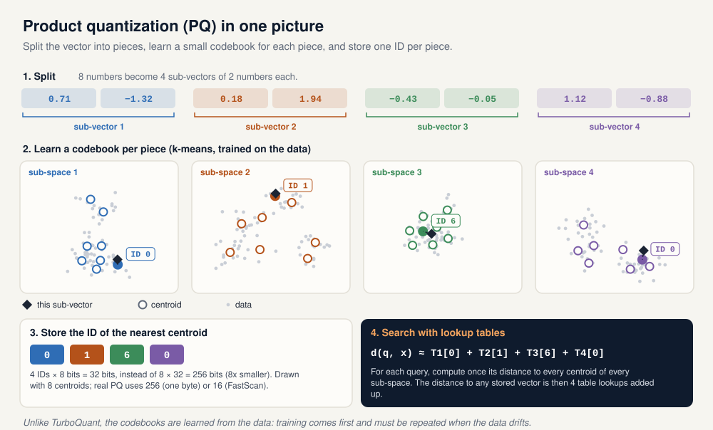

PQ (Jégou, Douze and Schmid, 2011, reference 9) works in four steps:

1. **Split.** Cut each vector of d numbers into m sub-vectors of d/m numbers. The figure cuts 8 numbers into 4 sub-vectors of 2.
2. **Learn a codebook for each sub-space.** For each of the m positions, run k-means on the sub-vectors of a training sample. This gives k centroids per sub-space: usually k = 256, so that an ID fits in one byte, or k = 16 (half a byte) in the FastScan variant.
3. **Encode.** Replace each sub-vector with the ID of its nearest centroid. A vector becomes m small integers: m bytes when k = 256.
4. **Search with lookup tables.** For each query, compute once the inner product (or distance) between every query sub-vector and every centroid of its sub-space: a table of m × k numbers. The score of any stored vector is then m table lookups added up, read at its IDs. The query itself is never compressed; this is called *asymmetric distance computation*.

The name comes from the fact that the set of vectors PQ can represent is the Cartesian *product* of the m small codebooks. With m = 4 and k = 256 there are 256⁴, about 4 billion, possible reconstructed vectors, described by only 4 × 256 stored centroids.

**Bits per number.** PQ spends m × log₂ k bits per vector, so the bit budget is set by m and k. In the demo at 4 bits per number (384 dimensions, 8x smaller than float32), `FAISS PQ LUT256` uses m = 192 sub-vectors of 2 numbers with 256 centroids each, 192 bytes per vector, exactly the setting drawn in the figure. `FAISS PQ-FastScan` reaches the same budget with m = 384 sub-vectors of 1 number and 16 centroids each.

**PQ versus TurboQuant.**

| | Product quantization | TurboQuant |
|---|---|---|
| Codebook | Learned with k-means on your data, one per sub-space | Fixed in advance and the same for all data (Lloyd-Max for a bell curve, section 3.2) |
| What is rounded | A group of numbers (a sub-vector) at once | One number at a time, after a random rotation |
| Before the first vector is stored | Training: 240 s for 100k vectors of 1536 dimensions in the paper; 83 s in our demo | Nothing: 0.0013 s to index the same 100k vectors in the paper |
| When the data drifts | Retrain and re-encode the index | Nothing changes |
| Recall@1@1 at 4 bits in the demo (section 7.2) | 0.818 | 0.944 (turbovec) |
| Scoring a query | Lookup tables built per query; very fast with FastScan | Rotate the query once, score against centroid values (section 3.3) |

**Why does a fixed codebook beat a learned one?** PQ's advantage is that its centroids follow the data, including correlations between the numbers inside a sub-vector. TurboQuant removes the need for that: after the random rotation every coordinate follows the same known distribution and the coordinates are nearly independent, so a fixed scalar codebook is already close to optimal (section 3.6). PQ also spends its few centroids on the training sample, which can drift away from the data indexed later.

**When PQ is still a good choice.** PQ is mature and available almost everywhere (FAISS `IndexPQ` and `IndexIVFPQ`, Milvus `IVF_PQ`, Qdrant product quantization), and it can go below 1 bit per number (for example one byte for 16 numbers), which a quantizer that rounds one number at a time cannot. For a static collection that is trained once and rarely changes, it remains a reasonable default. The case for TurboQuant is strongest where vectors arrive continuously (a KV cache, a live index) or where retraining is costly.

---

## 7. The demos

Both demos are Colab notebooks generated from the `.py` scripts in this repository (`build_notebooks.py` rebuilds them and embeds `turboquant_core.py` in a `%%writefile` cell, so each notebook runs on its own).

**How to run them:**

1. Go to colab.research.google.com › File › Upload notebook.
2. LLM demo: Runtime › Change runtime type › **T4 GPU** (free tier). Vector demo: CPU is fine.
3. Runtime › Run all. If the first cell upgrades `transformers` to v5, restart the session once and run again.

| File | What it is |
|---|---|
| `llm_kv_cache_demo.ipynb` | KV-cache demo; set `MODEL_ID` to try another model |
| `vector_search_demo.ipynb` | Search benchmark; set `DATASET` to `dbpedia-3072` or `20newsgroups-lsa` |
| `turboquant_core.py`, `*.py` | The implementation and the script versions of both demos |

### 7.1 Demo 1: LLM inference (`llm_kv_cache_demo.ipynb`)

**Goal:** show TurboQuant compressing the KV cache of a real model, measure what it does to quality, memory and speed, and compare it with a classic INT-*b* cache that pays for scales.

**Setup:** Qwen2.5-1.5B-Instruct (28 layers, 2 KV heads, head_dim 128) on a T4 in FP16; on CPU it switches to Qwen2.5-0.5B-Instruct with shorter inputs. The integration point is a drop-in Hugging Face cache:

```python
from turboquant_core import TurboQuantCache, mixed_factory

cache = TurboQuantCache(
    model.config,
    make_k=mixed_factory(0.25, 3, 2),   # 32 channels @3 bits + 96 @2 bits
    make_v=mixed_factory(0.25, 3, 2),
)
out = model.generate(ids, past_key_values=cache, max_new_tokens=64)
print(cache.nbytes())                    # measured from the packed tensors
```

Nothing in the model changes. Each layer gets its own random rotation (seed = layer index).

**Walkthrough by notebook section:**

| Notebook section | What it shows | Guide section |
|---|---|---|
| 1. Theory check | MSE versus the paper's bounds for b = 1 to 5; bias of MSE versus the unbiased prod variant; the rotated-coordinate density with 3-bit centroids | 3.1 to 3.6 |
| 2. Load a model | The ten cache configurations compared: FP16, TurboQuant 4 / 3.5 / 3 / 2.5 / 2 bits, TurboQuant_prod 3-bit keys, INT4 / INT3 / INT2 with scales | 1.5, 3.5 |
| 3. Quality | Perplexity, KL divergence from the FP16 model and top-1 agreement, with text fed in 128-token chunks so every chunk attends to the compressed cache of everything before it | 5.2 |
| 4. Needle in a haystack | A code hidden at 10%, 50% and 90% depth of 2k, 4k and 8k-token documents; every answer token is generated from the compressed cache | 5.2 |
| 5. Memory | Measured cache bytes and peak GPU memory; projection for Llama-3.1-8B | 5.4 |
| 6. Speed | Decode tokens per second; why the reference cache is slower and where fused kernels come in | 5.3 |

**Measured memory** (bit-packed tensors, fp16 norms included, head_dim 128):

| Cache | Bits per channel | vs FP16 |
|---|---|---|
| FP16 | 16 | 1.0x |
| INT4, scale + zero per 32 | 5.0 | 3.2x |
| TurboQuant 4-bit | 4.125 | 3.9x |
| TurboQuant 3.5 (64 @4b + 64 @3b) | 3.75 | 4.3x |
| TurboQuant 3-bit | 3.125 | 5.1x |
| TurboQuant 2.5 (32 @3b + 96 @2b) | 2.5 | 6.4x |
| TurboQuant 2-bit | 2.125 | 7.5x |

**What to look for when it runs:**

* The uncompressed baseline should find the needle at every length and depth. If it does not, the problem is the prompt, not quantization.
* Perplexity and KL should get worse as bits go down, with TurboQuant 4-bit close to the baseline.
* Compare TurboQuant at about 3 bits with INT2 (3.0 effective bits) and INT3 (4.0 effective bits) to see the scale-overhead story from section 1.5.
* TurboQuant decoding is **slower** than FP16 in this notebook. That is expected: the reference cache dequantizes the whole history in PyTorch at every step. Speed requires fused kernels (section 5.3).

> **Status of the numbers.** The memory figures above are exact for this implementation. The quality, needle and speed numbers for Qwen are produced when the notebook runs on a GPU; they could not be measured in the cloud sandbox where the code was built (no model downloads). `CURSOR_HANDOFF.md` (test T2) lists the runs still to be done.

### 7.2 Demo 2: vector search (`vector_search_demo.ipynb`)

**Goal:** reproduce the paper's search comparison: recall, index size, build time and query speed for TurboQuant against trained baselines.

**Methods compared:**

| Method | Training | Notes |
|---|---|---|
| Exact float32 (FAISS `IndexFlatIP`) | none | ground truth |
| **TurboQuant (reference PyTorch)** | none | `turboquant_core.py`, MSE and prod variants, 2 and 4 bits |
| **turbovec** | none | Rust + SIMD implementation of TurboQuant (`pip install turbovec`) |
| FAISS PQ, 256 centroids per sub-space (LUT256) | k-means | the paper's PQ baseline |
| FAISS PQ-FastScan, 16 centroids | k-means | fastest FAISS PQ |
| FAISS RaBitQ | light | the paper's other baseline |
| FAISS SQ 4-bit | min/max | plain per-dimension scalar quantization |

**Data:** by default the paper's DBpedia entities embedded with OpenAI `text-embedding-3-large` (1536 dimensions), streamed from the Hugging Face Hub: 100k database vectors and 1k queries. `dbpedia-3072` and an offline `20newsgroups-lsa` fallback are also available.

**Walkthrough by notebook section:**

| Notebook section | What it shows | Guide section |
|---|---|---|
| 1. Load embeddings | Streams the dataset, normalizes vectors so cosine similarity equals inner product | 6.1 |
| 2. Ground truth and metrics | Exact top-100 with FAISS; Recall@1@k and 10@10 | 6.3 |
| 3. TurboQuant, reference implementation | Encoding with no training; scoring in the rotated space; MSE and prod variants | 3.3, 3.4 |
| 4. turbovec | The same algorithm with SIMD kernels | 6.2 |
| 5. Trained baselines | FAISS PQ, PQ-FastScan, RaBitQ, SQ4, with k-means training time counted as indexing time | 6.3 |
| 6. Results | Table and recall curves at 2 and 4 bits; indexing-time chart | 7.2 |
| 7. Online ingestion | 100k vectors streamed in batches of 1,000 with no training | 6.2 |
| 8. Two-stage search | Compressed top-100, then exact re-rank | 6.2 |

**Results from the sandbox run.** The cloud sandbox could not reach the Hugging Face Hub, so the run below used 100k + 1k vectors of 384-dimension embeddings of real text (Reuters, Gutenberg and Brown corpora; TF-IDF + SVD), on 4 CPU threads. Same protocol as the paper, different data. These are the numbers on the "Demo 2" slides.

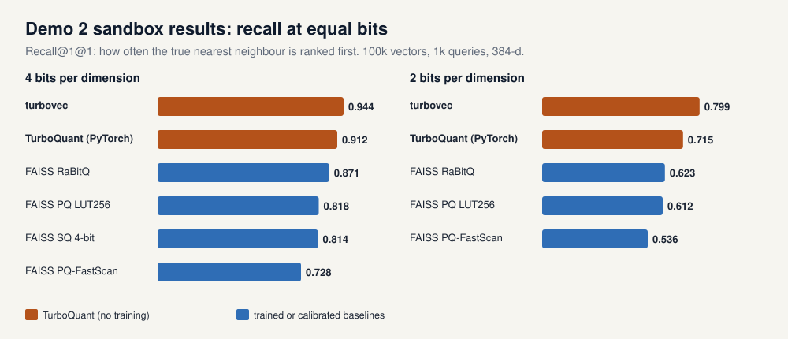

| Method | Bits | Smaller | Build (s) | QPS | R1@1 | 10@10 |
|---|---|---|---|---|---|---|
| **turbovec** | 4 | 7.7x | 0.9 | 10,008 | **0.944** | **0.951** |
| **TurboQuant_mse (PyTorch)** | 4 | 7.9x | 0.9 | 950 | **0.912** | **0.934** |
| FAISS RaBitQ | 4 | 7.2x | 1.4 | 862 | 0.871 | 0.891 |
| FAISS PQ LUT256 | 4 | 8.0x | 83.4 | 390 | 0.818 | 0.870 |
| FAISS SQ4 | 4 | 8.0x | 0.06 | 470 | 0.814 | 0.856 |
| FAISS PQ-FastScan | 4 | 8.0x | 4.4 | 3,784 | 0.728 | 0.808 |
| **turbovec** | 2 | 15.0x | 0.8 | 9,340 | **0.799** | **0.832** |
| **TurboQuant_mse (PyTorch)** | 2 | 15.7x | 0.7 | 1,039 | **0.715** | **0.802** |
| FAISS RaBitQ | 2 | 13.2x | 0.9 | 1,717 | 0.623 | 0.704 |
| FAISS PQ LUT256 | 2 | 16.0x | 6.6 | 930 | 0.612 | 0.724 |
| FAISS PQ-FastScan | 2 | 16.0x | 1.6 | 6,342 | 0.536 | 0.649 |

Exact float32 search ran at 857 QPS.

> **How to read the columns.** All three are computed in `vector_search_demo.py` (section 2) against the exact answer, which is the top 100 neighbours by inner product from an uncompressed FAISS `IndexFlatIP` (the vectors are normalized, so this is cosine similarity).
>
> * **QPS (queries per second)** is speed: the 1,000 queries are sent as one batch asking for the top 64 results each, and QPS = 1,000 / seconds that call took, on the same 4 CPU threads for every method. Higher is faster. Build time is not included, and turbovec gets one small warm-up search first.
> * **R1@1** is the paper's Recall@1@k with k = 1: the fraction of queries where the first result returned is the true nearest neighbour. 0.944 means the top hit was right for 944 of the 1,000 queries. The paper's 1@k curves (and R1@4, R1@16, R1@64 in the notebook) relax this to "the true nearest neighbour appears anywhere in the first k results".
> * **10@10** compares lists, not just the top hit: for each query, how many of the true top 10 appear in the returned top 10, divided by 10, averaged over all queries. 0.951 means that on average 9.5 of the 10 true neighbours were found, in any order.
>
> Recall and QPS trade off against each other, so compare methods at the same bit budget: turbovec at 4 bits is both more accurate and faster here, which is the unusual part.

**Three messages from this run:**

1. **More recall with no training.** At 4 bits, turbovec ranks the true nearest neighbour first 94% of the time against 82% for PQ, and PQ needed 83 seconds of k-means first.
2. **Online ingestion.** 100k vectors were streamed into turbovec in 0.14 s in batches of 1,000, with zero training.
3. **Exact results after a cheap re-rank.** Re-scoring turbovec's top 100 with the full vectors gave Recall@1 = **1.000**.

> **Status of the numbers.** The DBpedia-1536 run on Colab is the reference setup from the paper; its results replace the sandbox table once measured (`CURSOR_HANDOFF.md`, test T3). Higher dimension should help TurboQuant further, since the rotated coordinates become more Gaussian and more independent as d grows.

---

## 8. Real case studies: two features where compression did not help

> **In plain words.** Sections 5 and 6 show where TurboQuant shines. A workshop also needs the opposite case. We tested TurboQuant, and the built-in int8, binary and BBQ options, on two "find similar" features of a real legal-documents platform. TurboQuant behaved as the paper promises, and in both cases it still did not help, because vector precision was not what limited the feature. The full story, with every table, is in the [case study chapter](Case_Study_Provision_Similarity_EN.md).

All numbers below come from local rebuilds of the two features, run on real platform data (`es_bench/` and `memo_bench/`). They are not measurements of the production system. No client data is in this repository: only aggregate numbers.

### 8.1 The two features

| | A. Similar provisions | B. Suggested responses for comment memos |
|---|---|---|
| What the user sees | "Provisions similar to this one, above X %" across a firm's provision database | Past responses to similar questions, while answering a new comment |
| Score of record | **Edit distance** (`rapidfuzz.fuzz.ratio`, 0–100) on the cleaned text | **Cosine** between `text-embedding-3-large` embeddings (3,072-d) |
| Where it lives | A precomputed pair matrix in PostgreSQL; stored if ≥ 30, UI default 70 | A Qdrant collection; **exact** search filtered by firm, 50 results, floor 0.5 then 0.42 |
| Pain | Storage growth and slow writes: each new provision is compared with every other one in the firm | Latency per request |
| Do vectors matter? | Embeddings (`text-embedding-3-small`, 1,536-d) exist in Elasticsearch, but **no feature reads them** | Yes, they are the search |

**Premise check first.** The first benchmark plan (`provision_search_benchmark.*`, `PROVISION_SEARCH_CHECKS.md`) assumed a Qdrant collection of provision embeddings and a cosine auto-merge threshold of 0.90. Reading the platform code showed that neither exists. Qdrant holds comment memos only, and auto-merge also uses edit distance. The benchmark was rewritten for Elasticsearch (`es_bench/`).

### 8.2 Case A: similar provisions (`es_bench/`)

**Setup.** A local stand-in of the platform's index: 2,501 distinct provision texts, cleaned as the platform cleans them, embedded with the platform's model, in a local Elasticsearch 8.18 with the platform's mapping. Ground truth: exact `fuzz.ratio` of 500 query provisions against all 2,501. Twelve known-answer checks (`canary.py`) run before any number is trusted, for example the trigram code against PostgreSQL's real `pg_trgm`.

**How many pairs are "similar"?** Two unrelated long legal provisions already score about 38, so a low floor keeps almost every pair:

| Stored if fuzz.ratio ≥ | 30 | 40 | 50 | 60 | 70 |
|---|---|---|---|---|---|
| Share of all pairs kept | **70 %** | 45 % | **1.6 %** | 0.8 % | 0.7 % |

For a firm of 500,000 provisions that is about 87 billion pairs at a floor of 30, and about 2 billion at 50.

**Does compression change the pairs found?** Compressed cosine neighbours could at most pick *which* pairs to score. Recall of the pairs with fuzz.ratio ≥ 70 among 200 candidates per provision:

| Method | Memory vs float32 | Top-10 overlap with float32 (no rescore → rescore 2×) | Recall of fuzz ≥ 70 pairs @200 |
|---|---|---|---|
| float32 | 1× | 1.000 | 99.8 % |
| scalar int8 | 4× smaller | 0.949 → 0.999 | 99.8 % |
| binary 1-bit | 32× smaller | 0.824 → 0.962 | 99.7 % |
| TurboQuant 4-bit | 8× smaller | **0.966 → 1.000** | 99.8 % |
| TurboQuant 2-bit | 16× smaller | **0.902 → 0.992** | 99.8 % |
| Trigram neighbours (`pg_trgm`), no vectors | – | – | **100 %** |

TurboQuant keeps the cosine neighbours better than int8 or binary at each bit budget, as the paper promises. The pairs the product scores do not move, because they are near-duplicates that every method finds. Elasticsearch's own options agree: top-10 overlap with exact search is 0.993 for `hnsw`, 0.986 for `int8_hnsw`, 0.950 for `int4_hnsw` (0.996 with rescoring) and 0.878 for `bbq_hnsw` (0.995 with rescoring). Elasticsearch 8.18 already applies `int8_hnsw` by default when a mapping does not choose.

**Verdict A: TurboQuant cannot help.** The score is edit distance, not cosine, and the cost is the number of pairs kept, which no vector technique changes. The levers are the floor (a product decision) and a candidate filter; trigram matching, already in PostgreSQL, does as well as the embeddings.

### 8.3 Case B: comment-memo suggestions (`memo_bench/`)

**Setup.** A local rebuild of the memo path: 1,238 real comments (685 questions, 553 responses), the platform's model, the same Qdrant version, exact search with the firm filter, own thread excluded, 50 results, floors 0.5 then 0.42. Known-answer check first: Qdrant's results equal a numpy exact search on 200 of 200 queries.

**Where the time goes in one suggestion request:**

| Step | Time (p50) |
|---|---|
| Embedding the new comment (API call) | ~240 ms |
| Vector search, 1,238 memos, exact | **~14 ms** |
| LLM relevance check over the top 12 (a call of similar size, not the platform's own gate) | **~3,800 ms** |

**When would the search matter?** All memos in one firm, the worst case for exact search:

| Memos in the firm | Exact search p50 | Vector RAM, float32 | With Qdrant's built-in int8 |
|---|---|---|---|
| 10,000 | 21 ms | 117 MB | 29 MB |
| 50,000 | 53 ms | 586 MB | 146 MB |
| 200,000 | 339 ms | 2.3 GB | 0.6 GB (255 ms) |

**Does compression change the suggestions?** Score floor 0.5, pairs from each question's top 50:

| Method | Memory per vector | Top-10 overlap | Suggestions dropped at 0.5 |
|---|---|---|---|
| float32 | 12 KB | 1.000 | 0 |
| scalar int8 (offline) | 3 KB | 0.965 | 1,438 of 22,193 (6.5 %) |
| **TurboQuant 4-bit** | 1.5 KB | **0.983** | **244 (1.1 %)** |
| TurboQuant 2-bit | 0.75 KB | 0.945 | 3,574 (16 %) |
| Qdrant int8 / binary **with rescoring** | – | – | **0** |

**Verdict B: TurboQuant does not help here either.** The vector search is well under 1 % of the request, suggestions are computed in the background, and Qdrant's own quantization with rescoring loses nothing with no new code. What the benchmark did find: two random memos already score 0.38 on average (95th percentile 0.56), so the 0.5 floor lets through about 152 candidates per question. Suggestion quality depends on the re-ranker and the LLM check, not on vector precision.

### 8.4 Checklist: before you compress vectors

1. **Where are the vectors written and read?** If nothing reads them, ask whether to keep paying for them, not how to compress them.
2. **Is the product's score a vector score?** If it is edit distance, BM25 or a rule, vectors can only pre-filter, and a lexical pre-filter may do as well.
3. **What dominates the cost?** Count stored items, model calls and round trips. Compression shrinks bytes per vector, not the number of anything.
4. **Is search exact or approximate?** Exact search on small filtered sets is rarely memory-bound.
5. **Validate the instruments.** Check every measurement against a known answer before trusting it.

---

## 9. Practical guidance

**KV cache**

* Start at **4 bits** (with norm correction). Try **3.5** and **2.5** bits with outlier channels, the paper's sweet spots.
* Use the **MSE variant for keys**. The QJL bit adds variance that the softmax amplifies at low bit-widths.
* For speed, serve with **vLLM's fused kernels** on Ampere or Hopper GPUs; the reference PyTorch cache saves memory but is slower than FP16.
* **Run your own evaluations** (especially reasoning, math and code) before going to 3 bits or below.

**Vector search**

* **turbovec at 4 bits** gives an 8x smaller index than float32 with high recall.
* **Re-rank the top 100** with exact vectors for near-perfect results.
* **2 bits** gives 16x compression when recall@8 or higher is what matters.
* **No training:** ingest vectors online and never re-index because the data drifted.

---

## 10. Limitations and open questions

* **The reference implementation is not a kernel.** `turboquant_core.py` dequantizes in PyTorch: it saves memory, but decoding is slower than FP16. Real speedups need fused kernels (vLLM, or community Triton kernels).
* **Unbiased is not always better.** TurboQuant_prod's QJL stage removes bias but adds variance; at 3 bits and above, and inside a softmax, the MSE variant is usually the better choice.
* **Aggressive settings cost accuracy on hard tasks.** vLLM reports drops of up to about 20 points on hard math and coding with the 3-bit variants. 4-bit is the safe default.
* **Outlier splitting needs a calibration sample.** `MixedTurboQuant` picks outlier channels from the prefill. That is light, but it is not strictly data-oblivious.
* **Beam search and cache cropping** are not supported by the demo's `TurboQuantCache`; use greedy or sampled decoding.
* **Pending measurements.** LLM quality, needle and speed numbers for Qwen, and the DBpedia-1536 search results, are still to be measured on real hardware (see `CURSOR_HANDOFF.md`).
* **Compression is not always the lever.** When the product's score is not a vector score, or the cost is the number of stored items or model calls, compressing vectors changes nothing. Two worked examples with real data are in section 8 and the [case study chapter](Case_Study_Provision_Similarity_EN.md).

---

## 11. Glossary

| Term | Meaning |
|---|---|
| **Vector / embedding** | A list of numbers that represents a token, document or image. Similar items get similar vectors. |
| **Inner product (dot product)** | Sum of element-wise products of two vectors; the standard similarity score. Attention scores and search scores are inner products. |
| **Cosine similarity** | Inner product of two vectors scaled to length 1. |
| **Quantization** | Storing numbers with fewer bits by rounding them to a small set of allowed values. |
| **Bit-width (b)** | Bits per stored number. 16 for FP16, 4 for INT4 or TurboQuant 4-bit. |
| **Bits per channel** | Effective storage per number, including any overhead such as scales or norms. |
| **Scale and zero point** | Per-block numbers that classic quantizers store to map integers back to real values. |
| **Norm (‖x‖)** | The length of a vector. TurboQuant stores it in 16 bits. |
| **Random rotation (Π)** | A random orthogonal matrix. It preserves lengths and angles and spreads energy evenly across coordinates. |
| **Lloyd-Max quantizer / codebook** | The set of allowed values that minimizes the expected squared error for a known distribution; computed with a 1-D k-means. |
| **Centroid** | One allowed value of the codebook. |
| **MSE (mean squared error)** | Average squared distance between the original and the reconstructed vector. |
| **Bias** | A systematic error: estimates that are too high or too low on average. |
| **Unbiased estimator** | An estimator that is right on average. |
| **QJL** | Quantized Johnson-Lindenstrauss transform: random projection followed by keeping only signs; gives unbiased inner products. |
| **Residual** | What is left after the first quantization stage: r = x − x̃. |
| **KV cache** | The stored keys and values of past tokens in a transformer, reused at every generation step. |
| **Attention** | The transformer operation that compares the current query with all cached keys and mixes the cached values. |
| **Prefill / decode** | Processing the prompt in one pass / generating tokens one at a time. |
| **Outlier channel** | A coordinate of keys or values with much larger magnitude than the others. |
| **Fused kernel** | A GPU routine that does several steps (here: unpacking and attention) in one pass without writing intermediate results to memory. See section 5.3. |
| **Perplexity** | How surprised a language model is by a text; lower is better. |
| **KL divergence** | How different two probability distributions are; here, the compressed model's next-token distribution versus the FP16 model's. |
| **Needle in a haystack** | A test that hides a fact in a long document and asks the model to retrieve it. Its score (0 to 1) is a recall score averaged over document lengths and needle depths. See section 5.2. |
| **LongBench** | A benchmark of long-context tasks (QA, summarization, code and more), each scored from 0 to 100. |
| **LongBench-E** | The length-balanced subset of LongBench, with comparable numbers of inputs at 0–4k, 4k–8k and 8k+ tokens. See section 5.2. |
| **Product quantization (PQ)** | A trained vector-compression method: split vectors into sub-vectors and replace each with the nearest of a set of k-means centroids. See section 6.4. |
| **RaBitQ** | A randomized binary quantization method for vector search; one of the paper's baselines. |
| **Recall@1@k** | Fraction of queries whose true nearest neighbour appears in the top k results. |
| **10@10** | Overlap between the true top 10 and the returned top 10. |
| **QPS** | Queries per second. |
| **RAG** | Retrieval-augmented generation: retrieving documents with vector search and giving them to an LLM as context. |
| **Data-oblivious / online** | Needs no information about the data in advance; vectors can be quantized as they arrive. |

---

## 12. References

1. A. Zandieh, M. Daliri, M. Hadian, V. Mirrokni. *TurboQuant: Online Vector Quantization with Near-optimal Distortion Rate.* arXiv:2504.19874, 2025. (`docs/2504.19874v1.pdf`)
2. A. Zandieh, M. Daliri, I. Han. *QJL: 1-Bit Quantized JL Transform for KV Cache Quantization with Zero Overhead.* arXiv:2406.03482, 2024. (`docs/2406.03482v2.pdf`)
3. I. Han, P. Kacham, A. Karbasi, V. Mirrokni, A. Zandieh. *PolarQuant: Quantizing KV Caches with Polar Transformation.* arXiv:2502.02617, 2025. (`docs/2502.02617v1.pdf`)
4. Google Research blog. *TurboQuant: redefining AI efficiency with extreme compression.* https://research.google/blog/turboquant-redefining-ai-efficiency-with-extreme-compression/
5. vLLM blog. *TurboQuant KV cache* (May 2026). https://vllm.ai/blog/2026-05-11-turboquant
6. turbovec (Rust + SIMD TurboQuant for vector search): https://github.com/ryancodrai/turbovec
7. turboquant (Triton kernels and vLLM integration for RTX 30/40/50 GPUs): https://github.com/0xsero/turboquant
8. *TurboQuant vs traditional quantization: eliminating memory overhead in LLMs* (Medium). https://medium.com/@tahirbalarabe2/turboquant-vs-traditional-quantization-eliminating-memory-overhead-in-llms-24524af4adb8
9. H. Jégou, M. Douze, C. Schmid. *Product Quantization for Nearest Neighbor Search.* IEEE Transactions on Pattern Analysis and Machine Intelligence, 33(1), 2011.

---

## Appendix A: how the guide, slides and notebooks line up

The guide and the deck follow the same order: theory first (sections 1 to 3, slides 1 to 9), then the applied material (sections 4 to 9, slides 10 to 26).

| Guide section | Slides (deck order) | Notebook |
|---|---|---|
| 1. Introduction | 1 *TurboQuant* (cover) | – |
| 1.1 How the KV cache works | 2 *Background · The KV cache* | – |
| 1.2 Why memory is the bottleneck | 3 *The problem* | – |
| 1.3 and 1.4 Quantization | 4 *Background · Quantization* | – |
| 1.5 The hidden tax | 5 *The hidden tax* | LLM §2 (INT-b configurations) |
| 1.6 Results at a glance | – (guide only) | – |
| 2. Three papers | 6 *Three papers, one idea* | – |
| 3.1 to 3.3 Rotation and codebook | 7 *Stage 1 · TurboQuant_mse* | LLM §1, vector §3 |
| 3.4 TurboQuant_prod | 8 *Stage 2 · TurboQuant_prod* | LLM §1 |
| 3.5 Outlier channels | – (guide only; slide 13 notes) | LLM §2 |
| 3.6 Near-optimal | 9 *Near-optimal* | LLM §1 |
| 3.7 The algorithm in code | – (guide only) | `turboquant_core.py` |
| 4.1 QJL by hand | 10 *QJL · Worked example* | `worked_examples.py` |
| 4.2 PolarQuant by hand | 11 *PolarQuant · Worked example* | `worked_examples.py` |
| 4.3 TurboQuant end to end | 12 *TurboQuant · Worked example* | `worked_examples.py` |
| 5. Use case 1: KV cache (5.2 paper results, 5.3 production) | 13 *Paper results · KV cache*, 14 *In production* | LLM §3 to §6 |
| 6. Use case 2: vector search (6.3 paper results, 6.4 PQ) | 15 *Paper results · Vector search* | vector §5 |
| 7. Demos | 16 *The demos*, 17 *Run it yourself* | both notebooks |
| 7.1 Demo 1 | 18 and 19 *Demo 1* | LLM notebook |
| 7.2 Demo 2 | 20 and 21 *Demo 2* | vector notebook |
| 8. Real case studies | 22 *Case studies · Real data*, 23 *Case A*, 24 *Case B*, 25 *Case studies · Lessons* | `es_bench/`, `memo_bench/` |
| 9. Practical guidance | 26 *Practical guidance* | – |
| 10. Limitations, 11. Glossary | – (guide only) | – |
| 12. References | 27 *References* | – |
| Case study (separate chapter) | – | `es_bench/`, `memo_bench/` |

### Suggested workshop agenda (about 90 minutes)

| Time | Block | Material |
|---|---|---|
| 0:00 | How the KV cache works; why memory is the bottleneck; how quantization works; the hidden tax | Guide §1, slides 1 to 5 |
| 0:10 | The three papers | Guide §2, slide 6 |
| 0:15 | How it works: rotation, codebook, QJL residual, bounds | Guide §3, slides 7 to 9 |
| 0:30 | Worked examples by hand: QJL, PolarQuant, TurboQuant | Guide §4, slides 10 to 12 |
| 0:40 | Use cases: KV cache and vector search, paper and production results | Guide §5 and §6, slides 13 to 15 |
| 0:50 | Hands-on: run both notebooks | Guide §7, slides 16 to 21 |
| 1:10 | Two real cases where compression does not help | Guide §8, slides 22 to 25, case study chapter |
| 1:20 | Practical guidance, limitations, Q&A | Guide §9 and §10, slides 26 and 27 |

---

*Figures are generated by `docs/guide/make_figures.py` (English and Spanish versions); the rotation, bias and bounds charts are computed live with `turboquant_core.py`.*
